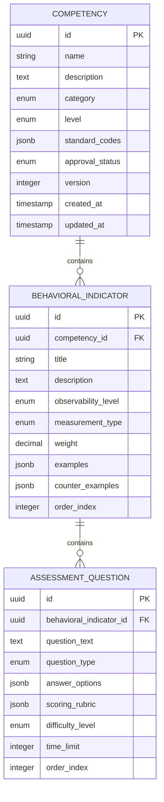

# Skillsoft Application Documentation

> **Comprehensive Technical and Domain Documentation**  
> Version: 1.0.0 | Last Updated: 2025

---

## Table of Contents

1. [Technical Architecture Overview](#1-technical-architecture-overview)
2. [Domain Model & Entity Hierarchy](#2-domain-model--entity-hierarchy)
3. [API Specification](#3-api-specification)
4. [Frontend Architecture](#4-frontend-architecture)
5. [Backend Architecture](#5-backend-architecture)
6. [Infrastructure & Deployment](#6-infrastructure--deployment)
7. [Purpose & Business Context](#7-purpose--business-context)
8. [Development Workflows](#8-development-workflows)
9. [Security & Authentication](#9-security--authentication)
10. [Testing Strategy](#10-testing-strategy)

---

## 1. Technical Architecture Overview

### 1.1 Full-Stack Architecture

Skillsoft is a competency management system built with a modern full-stack architecture:

```
┌─────────────────────────────────────────────────────────────────────────┐
│                           CLIENT LAYER                                   │
│  ┌─────────────────────────────────────────────────────────────────┐   │
│  │                    Next.js 14+ Frontend                          │   │
│  │  ┌──────────┐  ┌──────────┐  ┌──────────┐  ┌──────────────────┐ │   │
│  │  │ App      │  │ shadcn/  │  │ Tailwind │  │ TypeScript       │ │   │
│  │  │ Router   │  │ ui       │  │ CSS      │  │ Type Safety      │ │   │
│  │  └──────────┘  └──────────┘  └──────────┘  └──────────────────┘ │   │
│  └─────────────────────────────────────────────────────────────────┘   │
└─────────────────────────────────────────────────────────────────────────┘
                                    │
                                    │ REST API (JSON)
                                    ▼
┌─────────────────────────────────────────────────────────────────────────┐
│                         APPLICATION LAYER                                │
│  ┌─────────────────────────────────────────────────────────────────┐   │
│  │                  Spring Boot 3.5+ Backend                        │   │
│  │  ┌──────────┐  ┌──────────┐  ┌──────────┐  ┌──────────────────┐ │   │
│  │  │ REST     │  │ Service  │  │ JPA/     │  │ Clerk Auth       │ │   │
│  │  │ Controllers│ │ Layer    │  │ Hibernate│  │ Integration      │ │   │
│  │  └──────────┘  └──────────┘  └──────────┘  └──────────────────┘ │   │
│  └─────────────────────────────────────────────────────────────────┘   │
└─────────────────────────────────────────────────────────────────────────┘
                                    │
                                    │ JDBC/JPA
                                    ▼
┌─────────────────────────────────────────────────────────────────────────┐
│                           DATA LAYER                                     │
│  ┌─────────────────────────────────────────────────────────────────┐   │
│  │                   PostgreSQL 15+ Database                        │   │
│  │  ┌──────────────┐  ┌──────────────┐  ┌──────────────────────┐   │   │
│  │  │ Relational   │  │ JSONB        │  │ Full-Text Search     │   │   │
│  │  │ Tables       │  │ Columns      │  │ Capabilities         │   │   │
│  │  └──────────────┘  └──────────────┘  └──────────────────────┘   │   │
│  └─────────────────────────────────────────────────────────────────┘   │
└─────────────────────────────────────────────────────────────────────────┘
```

### 1.2 Technology Stack Summary

| Layer | Technology | Version | Purpose |
|-------|------------|---------|---------|
| **Frontend** | Next.js | 14+ | React framework with App Router |
| **UI Components** | shadcn/ui | Latest | Accessible, customizable components |
| **Styling** | TailwindCSS | 3.x | Utility-first CSS framework |
| **Language** | TypeScript | 5.x | Type-safe JavaScript |
| **Backend** | Spring Boot | 3.5+ | Java REST API framework |
| **ORM** | Hibernate/JPA | 6.x | Object-Relational Mapping |
| **Database** | PostgreSQL | 15+ | Relational database with JSONB |
| **Authentication** | Clerk | Latest | User management and auth |
| **Containerization** | Docker | Latest | Development and deployment |
| **Deployment** | Railway.app | - | Cloud platform |

### 1.3 Frontend Stack Details

#### App Router Architecture
- **File-based routing** in `app/` directory
- **React Server Components** for improved performance
- **Server Actions** for form handling and mutations
- **Parallel routes** and **intercepting routes** support
- **Streaming** and **Suspense** for progressive rendering

#### UI Component Library
- **shadcn/ui** provides accessible, customizable base components
- Components located in `src/components/ui/`
- Built on **Radix UI** primitives for accessibility
- **TailwindCSS** for styling with design tokens

#### State Management
- **React Server Components** for server state
- **React hooks** for client-side state
- **URL state** for shareable application state
- Custom hooks in `src/hooks/` directory

### 1.4 Backend Stack Details

#### Spring Boot Configuration
- **Spring Data JPA** for database operations
- **Hibernate** as JPA implementation
- **JSONB columns** for flexible data structures
- **DTO/Mapper pattern** for API responses
- **Transactional service layer** for business logic

#### API Design Principles
- RESTful endpoints following standard conventions
- Consistent response formats with proper HTTP status codes
- CORS configuration for cross-origin requests
- Environment-based configuration management

---

## 2. Domain Model & Entity Hierarchy

### 2.1 Core Entity Relationships

```
┌─────────────────────────────────────────────────────────────────────────────┐
│                          DOMAIN MODEL OVERVIEW                               │
└─────────────────────────────────────────────────────────────────────────────┘

┌──────────────────┐         ┌────────────────────────┐         ┌─────────────────────┐
│   COMPETENCY     │ 1     N │  BEHAVIORAL INDICATOR  │ 1     N │ ASSESSMENT QUESTION │
│                  │────────▶│                        │────────▶│                     │
│  - id            │         │  - id                  │         │  - id               │
│  - name          │         │  - title               │         │  - questionText     │
│  - description   │         │  - description         │         │  - questionType     │
│  - category      │         │  - observabilityLevel  │         │  - answerOptions    │
│  - level         │         │  - measurementType     │         │  - scoringRubric    │
│  - standardCodes │         │  - weight              │         │  - difficultyLevel  │
│  - approvalStatus│         │  - examples            │         │  - timeLimit        │
│  - version       │         │  - counterExamples     │         │  - orderIndex       │
│                  │         │  - orderIndex          │         │                     │
└──────────────────┘         └────────────────────────┘         └─────────────────────┘
         │
         │ N:M (via Junction Table)
         ▼
┌──────────────────┐
│ STANDARD CODES   │
│                  │
│  - ESCO          │
│  - O*NET         │
│  - Big Five      │
│  - Custom        │
└──────────────────┘
```

### 2.2 Entity Definitions

#### 2.2.1 Competency Entity

**Purpose**: Represents a measurable soft skill or competency that can be assessed.

**Fields**:

| Field | Type | Description | Constraints |
|-------|------|-------------|-------------|
| `id` | UUID | Unique identifier | Primary Key, Auto-generated |
| `name` | String | Competency name | Required, Max 255 chars |
| `description` | String | Detailed description | Required, Text |
| `category` | Enum | Competency category | Required |
| `level` | Enum | Proficiency level | Required |
| `standardCodes` | JSONB | External standard mappings | Optional |
| `approvalStatus` | Enum | Workflow status | Required, Default: DRAFT |
| `version` | Integer | Version number | Required, Default: 1 |
| `createdAt` | Timestamp | Creation timestamp | Auto-generated |
| `updatedAt` | Timestamp | Last update timestamp | Auto-updated |

**Category Enum Values**:
- `COMMUNICATION` - Interpersonal communication skills
- `LEADERSHIP` - Leadership and management abilities
- `PROBLEM_SOLVING` - Analytical and problem-solving skills
- `TEAMWORK` - Collaboration and team-oriented skills
- `ADAPTABILITY` - Flexibility and change management
- `EMOTIONAL_INTELLIGENCE` - Self-awareness and empathy
- `TIME_MANAGEMENT` - Organization and prioritization
- `CREATIVITY` - Innovation and creative thinking

**Level Enum Values**:
- `ENTRY` - Entry-level proficiency
- `INTERMEDIATE` - Mid-level proficiency
- `ADVANCED` - Advanced proficiency
- `EXPERT` - Expert-level proficiency

**Approval Status Enum Values**:
- `DRAFT` - Initial creation state
- `PENDING_REVIEW` - Submitted for review
- `APPROVED` - Approved for use
- `REJECTED` - Rejected, needs revision
- `ARCHIVED` - No longer active

#### 2.2.2 Behavioral Indicator Entity

**Purpose**: Observable behaviors that demonstrate competency mastery.

**Fields**:

| Field | Type | Description | Constraints |
|-------|------|-------------|-------------|
| `id` | UUID | Unique identifier | Primary Key |
| `competencyId` | UUID | Parent competency | Foreign Key, Required |
| `title` | String | Indicator title | Required, Max 255 chars |
| `description` | String | Detailed description | Required |
| `observabilityLevel` | Enum | How observable | Required |
| `measurementType` | Enum | Assessment method | Required |
| `weight` | Decimal | Importance weight | Required, 0.0-1.0 |
| `examples` | JSONB | Positive behavior examples | Optional |
| `counterExamples` | JSONB | Negative behavior examples | Optional |
| `orderIndex` | Integer | Display order | Required |

**Observability Level Enum**:
- `DIRECTLY_OBSERVABLE` - Can be seen in behavior
- `INDIRECTLY_OBSERVABLE` - Inferred from outcomes
- `SELF_REPORTED` - Based on self-assessment

**Measurement Type Enum**:
- `LIKERT_SCALE` - Agreement scale (1-5 or 1-7)
- `FREQUENCY_SCALE` - How often behavior occurs
- `BEHAVIORAL_ANCHORED` - Specific behavior descriptions
- `SITUATIONAL_JUDGMENT` - Scenario-based responses
- `FREE_RESPONSE` - Open-ended text response

#### 2.2.3 Assessment Question Entity

**Purpose**: Individual questions used to measure behavioral indicators.

**Fields**:

| Field | Type | Description | Constraints |
|-------|------|-------------|-------------|
| `id` | UUID | Unique identifier | Primary Key |
| `behavioralIndicatorId` | UUID | Parent indicator | Foreign Key, Required |
| `questionText` | String | Question content | Required |
| `questionType` | Enum | Question format | Required |
| `answerOptions` | JSONB | Available answers | Required for closed questions |
| `scoringRubric` | JSONB | Scoring guidelines | Required |
| `difficultyLevel` | Enum | Question difficulty | Required |
| `timeLimit` | Integer | Seconds allowed | Optional |
| `orderIndex` | Integer | Display order | Required |

**Question Type Enum**:
- `SINGLE_CHOICE` - One correct answer
- `MULTIPLE_CHOICE` - Multiple correct answers
- `LIKERT` - Scale response
- `SITUATIONAL` - Scenario-based
- `OPEN_ENDED` - Free text response
- `RANKING` - Order items by preference

**Difficulty Level Enum**:
- `EASY` - Basic understanding
- `MEDIUM` - Applied knowledge
- `HARD` - Complex scenarios
- `EXPERT` - Nuanced judgment

### 2.3 JSONB Data Structures

#### Answer Options Structure
```json
{
  "options": [
    {
      "id": "opt_1",
      "text": "Option text in Russian",
      "value": 1,
      "isCorrect": true,
      "feedback": "Explanation for this choice"
    }
  ],
  "allowMultiple": false,
  "randomizeOrder": true
}
```

#### Scoring Rubric Structure
```json
{
  "maxScore": 5,
  "scoringMethod": "WEIGHTED",
  "criteria": [
    {
      "score": 5,
      "description": "Demonstrates exceptional understanding",
      "indicators": ["keyword1", "keyword2"]
    },
    {
      "score": 3,
      "description": "Shows adequate understanding",
      "indicators": ["keyword3"]
    },
    {
      "score": 1,
      "description": "Minimal understanding shown",
      "indicators": []
    }
  ]
}
```

#### Standard Codes Structure
```json
{
  "esco": ["S1.1.1", "S1.1.2"],
  "onet": ["2.A.1.a", "2.A.1.b"],
  "bigFive": ["Extraversion", "Conscientiousness"],
  "custom": {
    "internalCode": "COMM-001",
    "department": "HR"
  }
}
```

### 2.4 Entity Relationship Diagram (Mermaid)



---

## 3. API Specification

### 3.1 API Overview

The Skillsoft backend exposes a RESTful API with the following characteristics:

- **Base URL**: `http://localhost:8080/api` (development)
- **Content-Type**: `application/json`
- **Authentication**: Clerk JWT tokens
- **CORS**: Configured for frontend origins

### 3.2 Competency Endpoints

#### GET /api/competencies
Retrieve all competencies with optional filtering.

**Query Parameters**:
| Parameter | Type | Description |
|-----------|------|-------------|
| `category` | string | Filter by category |
| `level` | string | Filter by proficiency level |
| `status` | string | Filter by approval status |
| `page` | integer | Page number (default: 0) |
| `size` | integer | Page size (default: 20) |
| `sort` | string | Sort field and direction |

**Response** (200 OK):
```json
{
  "content": [
    {
      "id": "550e8400-e29b-41d4-a716-446655440000",
      "name": "Эффективная коммуникация",
      "description": "Способность ясно и убедительно выражать идеи...",
      "category": "COMMUNICATION",
      "level": "INTERMEDIATE",
      "standardCodes": {
        "esco": ["S1.1.1"],
        "onet": ["2.A.1.a"]
      },
      "approvalStatus": "APPROVED",
      "version": 1,
      "createdAt": "2025-01-15T10:30:00Z",
      "updatedAt": "2025-01-15T10:30:00Z",
      "behavioralIndicatorCount": 5
    }
  ],
  "pageable": {
    "pageNumber": 0,
    "pageSize": 20
  },
  "totalElements": 45,
  "totalPages": 3
}
```

#### GET /api/competencies/{id}
Retrieve a specific competency with full details.

**Path Parameters**:
| Parameter | Type | Description |
|-----------|------|-------------|
| `id` | UUID | Competency identifier |

**Response** (200 OK):
```json
{
  "id": "550e8400-e29b-41d4-a716-446655440000",
  "name": "Эффективная коммуникация",
  "description": "Способность ясно и убедительно выражать идеи...",
  "category": "COMMUNICATION",
  "level": "INTERMEDIATE",
  "standardCodes": {
    "esco": ["S1.1.1"],
    "onet": ["2.A.1.a"]
  },
  "approvalStatus": "APPROVED",
  "version": 1,
  "createdAt": "2025-01-15T10:30:00Z",
  "updatedAt": "2025-01-15T10:30:00Z",
  "behavioralIndicators": [
    {
      "id": "660e8400-e29b-41d4-a716-446655440001",
      "title": "Активное слушание",
      "description": "Демонстрирует внимание к собеседнику...",
      "observabilityLevel": "DIRECTLY_OBSERVABLE",
      "measurementType": "BEHAVIORAL_ANCHORED",
      "weight": 0.25,
      "orderIndex": 1
    }
  ]
}
```

#### POST /api/competencies
Create a new competency.

**Request Body**:
```json
{
  "name": "Критическое мышление",
  "description": "Способность анализировать информацию...",
  "category": "PROBLEM_SOLVING",
  "level": "ADVANCED",
  "standardCodes": {
    "esco": ["S2.1.1"],
    "onet": ["2.B.1.a"]
  }
}
```

**Response** (201 Created):
```json
{
  "id": "770e8400-e29b-41d4-a716-446655440002",
  "name": "Критическое мышление",
  "description": "Способность анализировать информацию...",
  "category": "PROBLEM_SOLVING",
  "level": "ADVANCED",
  "standardCodes": {
    "esco": ["S2.1.1"],
    "onet": ["2.B.1.a"]
  },
  "approvalStatus": "DRAFT",
  "version": 1,
  "createdAt": "2025-01-20T14:00:00Z",
  "updatedAt": "2025-01-20T14:00:00Z"
}
```

#### PUT /api/competencies/{id}
Update an existing competency.

**Request Body**:
```json
{
  "name": "Критическое мышление (обновлено)",
  "description": "Обновленное описание...",
  "category": "PROBLEM_SOLVING",
  "level": "EXPERT",
  "standardCodes": {
    "esco": ["S2.1.1", "S2.1.2"],
    "onet": ["2.B.1.a"]
  }
}
```

**Response** (200 OK): Updated competency object

#### DELETE /api/competencies/{id}
Delete a competency (soft delete - sets status to ARCHIVED).

**Response** (204 No Content)

### 3.3 Behavioral Indicator Endpoints

#### GET /api/competencies/{competencyId}/indicators
Retrieve all behavioral indicators for a competency.

**Response** (200 OK):
```json
[
  {
    "id": "660e8400-e29b-41d4-a716-446655440001",
    "competencyId": "550e8400-e29b-41d4-a716-446655440000",
    "title": "Активное слушание",
    "description": "Демонстрирует внимание к собеседнику...",
    "observabilityLevel": "DIRECTLY_OBSERVABLE",
    "measurementType": "BEHAVIORAL_ANCHORED",
    "weight": 0.25,
    "examples": [
      "Поддерживает зрительный контакт",
      "Задает уточняющие вопросы"
    ],
    "counterExamples": [
      "Перебивает собеседника",
      "Отвлекается на телефон"
    ],
    "orderIndex": 1,
    "questionCount": 3
  }
]
```

#### POST /api/competencies/{competencyId}/indicators
Create a new behavioral indicator.

**Request Body**:
```json
{
  "title": "Ясность изложения",
  "description": "Способность четко формулировать мысли...",
  "observabilityLevel": "DIRECTLY_OBSERVABLE",
  "measurementType": "LIKERT_SCALE",
  "weight": 0.30,
  "examples": ["Использует простой язык", "Структурирует информацию"],
  "counterExamples": ["Использует жаргон", "Говорит сбивчиво"],
  "orderIndex": 2
}
```

### 3.4 Assessment Question Endpoints

#### GET /api/indicators/{indicatorId}/questions
Retrieve all questions for a behavioral indicator.

**Response** (200 OK):
```json
[
  {
    "id": "880e8400-e29b-41d4-a716-446655440003",
    "behavioralIndicatorId": "660e8400-e29b-41d4-a716-446655440001",
    "questionText": "Как вы обычно реагируете, когда коллега высказывает мнение, с которым вы не согласны?",
    "questionType": "SITUATIONAL",
    "answerOptions": {
      "options": [
        {
          "id": "opt_1",
          "text": "Выслушиваю полностью, затем выражаю свою точку зрения",
          "value": 5
        },
        {
          "id": "opt_2",
          "text": "Сразу объясняю, почему я не согласен",
          "value": 2
        },
        {
          "id": "opt_3",
          "text": "Молча соглашаюсь, чтобы избежать конфликта",
          "value": 1
        }
      ],
      "randomizeOrder": true
    },
    "scoringRubric": {
      "maxScore": 5,
      "scoringMethod": "DIRECT"
    },
    "difficultyLevel": "MEDIUM",
    "timeLimit": 120,
    "orderIndex": 1
  }
]
```

#### POST /api/indicators/{indicatorId}/questions
Create a new assessment question.

### 3.5 Error Response Format

All API errors follow a consistent format:

```json
{
  "timestamp": "2025-01-20T14:30:00Z",
  "status": 400,
  "error": "Bad Request",
  "message": "Validation failed for field 'name': must not be blank",
  "path": "/api/competencies",
  "errors": [
    {
      "field": "name",
      "message": "must not be blank",
      "rejectedValue": ""
    }
  ]
}
```

**Common HTTP Status Codes**:
| Code | Description |
|------|-------------|
| 200 | Success |
| 201 | Created |
| 204 | No Content |
| 400 | Bad Request - Validation error |
| 401 | Unauthorized - Authentication required |
| 403 | Forbidden - Insufficient permissions |
| 404 | Not Found - Resource doesn't exist |
| 409 | Conflict - Resource already exists |
| 500 | Internal Server Error |

---

## 4. Frontend Architecture

### 4.1 Directory Structure

```
frontend-app/
├── app/                          # Next.js App Router
│   ├── (auth)/                   # Authentication routes group
│   │   ├── sign-in/              # Sign in page
│   │   └── sign-up/              # Sign up page
│   ├── (dashboard)/              # Dashboard routes group
│   │   ├── competencies/         # Competency management
│   │   │   ├── [id]/             # Single competency view
│   │   │   │   ├── page.tsx      # Competency detail page
│   │   │   │   └── edit/         # Edit competency
│   │   │   ├── new/              # Create competency
│   │   │   └── page.tsx          # Competency list
│   │   ├── assessments/          # Assessment management
│   │   ├── reports/              # Reporting dashboard
│   │   └── settings/             # User settings
│   ├── api/                      # API routes (if needed)
│   ├── interfaces/               # TypeScript interfaces
│   │   └── domain-interfaces.ts  # Domain type definitions
│   ├── layout.tsx                # Root layout
│   ├── page.tsx                  # Home page
│   └── globals.css               # Global styles
├── src/
│   ├── components/               # React components
│   │   ├── ui/                   # Base UI components (shadcn)
│   │   │   ├── button.tsx
│   │   │   ├── card.tsx
│   │   │   ├── dialog.tsx
│   │   │   ├── form.tsx
│   │   │   ├── input.tsx
│   │   │   ├── select.tsx
│   │   │   ├── sidebar.tsx
│   │   │   ├── table.tsx
│   │   │   └── ...
│   │   ├── app-sidebar.tsx       # Application sidebar
│   │   ├── competency-card.tsx   # Competency display card
│   │   ├── competency-form.tsx   # Competency create/edit form
│   │   ├── indicator-list.tsx    # Behavioral indicators list
│   │   ├── question-builder.tsx  # Question creation component
│   │   └── ...
│   ├── services/                 # API integration layer
│   │   └── api.ts                # Centralized API client
│   ├── hooks/                    # Custom React hooks
│   │   ├── use-competencies.ts   # Competency data hook
│   │   ├── use-debounce.ts       # Debounce utility hook
│   │   └── use-media-query.ts    # Responsive design hook
│   └── lib/                      # Utility functions
│       ├── utils.ts              # General utilities
│       └── cn.ts                 # Class name merger
├── public/                       # Static assets
├── package.json                  # Dependencies
├── tailwind.config.ts            # Tailwind configuration
├── tsconfig.json                 # TypeScript configuration
└── next.config.ts                # Next.js configuration
```

### 4.2 API Integration Layer

The API client in `src/services/api.ts` provides centralized API access:

```typescript
// Conceptual structure of api.ts

const API_BASE_URL = process.env.API_BASE_URL || 'http://localhost:8080/api';

interface ApiError {
  status: number;
  message: string;
  errors?: Array<{
    field: string;
    message: string;
  }>;
}

class ApiClient {
  private baseUrl: string;
  
  constructor(baseUrl: string) {
    this.baseUrl = baseUrl;
  }
  
  private async request<T>(
    endpoint: string,
    options?: RequestInit
  ): Promise<T> {
    const response = await fetch(`${this.baseUrl}${endpoint}`, {
      ...options,
      headers: {
        'Content-Type': 'application/json',
        ...options?.headers,
      },
    });
    
    if (!response.ok) {
      const error = await response.json();
      throw new ApiError(response.status, error.message);
    }
    
    return response.json();
  }
  
  // Competency methods
  async getCompetencies(params?: CompetencyQueryParams) {
    const query = new URLSearchParams(params as any).toString();
    return this.request<PagedResponse<Competency>>(
      `/competencies${query ? `?${query}` : ''}`
    );
  }
  
  async getCompetency(id: string) {
    return this.request<CompetencyDetail>(`/competencies/${id}`);
  }
  
  async createCompetency(data: CreateCompetencyRequest) {
    return this.request<Competency>('/competencies', {
      method: 'POST',
      body: JSON.stringify(data),
    });
  }
  
  async updateCompetency(id: string, data: UpdateCompetencyRequest) {
    return this.request<Competency>(`/competencies/${id}`, {
      method: 'PUT',
      body: JSON.stringify(data),
    });
  }
  
  async deleteCompetency(id: string) {
    return this.request<void>(`/competencies/${id}`, {
      method: 'DELETE',
    });
  }
  
  // Behavioral Indicator methods
  async getIndicators(competencyId: string) {
    return this.request<BehavioralIndicator[]>(
      `/competencies/${competencyId}/indicators`
    );
  }
  
  // Assessment Question methods
  async getQuestions(indicatorId: string) {
    return this.request<AssessmentQuestion[]>(
      `/indicators/${indicatorId}/questions`
    );
  }
}

export const api = new ApiClient(API_BASE_URL);
```

### 4.3 TypeScript Interfaces

Domain interfaces defined in `app/interfaces/domain-interfaces.ts`:

```typescript
// Enums
export enum CompetencyCategory {
  COMMUNICATION = 'COMMUNICATION',
  LEADERSHIP = 'LEADERSHIP',
  PROBLEM_SOLVING = 'PROBLEM_SOLVING',
  TEAMWORK = 'TEAMWORK',
  ADAPTABILITY = 'ADAPTABILITY',
  EMOTIONAL_INTELLIGENCE = 'EMOTIONAL_INTELLIGENCE',
  TIME_MANAGEMENT = 'TIME_MANAGEMENT',
  CREATIVITY = 'CREATIVITY',
}

export enum CompetencyLevel {
  ENTRY = 'ENTRY',
  INTERMEDIATE = 'INTERMEDIATE',
  ADVANCED = 'ADVANCED',
  EXPERT = 'EXPERT',
}

export enum ApprovalStatus {
  DRAFT = 'DRAFT',
  PENDING_REVIEW = 'PENDING_REVIEW',
  APPROVED = 'APPROVED',
  REJECTED = 'REJECTED',
  ARCHIVED = 'ARCHIVED',
}

export enum ObservabilityLevel {
  DIRECTLY_OBSERVABLE = 'DIRECTLY_OBSERVABLE',
  INDIRECTLY_OBSERVABLE = 'INDIRECTLY_OBSERVABLE',
  SELF_REPORTED = 'SELF_REPORTED',
}

export enum MeasurementType {
  LIKERT_SCALE = 'LIKERT_SCALE',
  FREQUENCY_SCALE = 'FREQUENCY_SCALE',
  BEHAVIORAL_ANCHORED = 'BEHAVIORAL_ANCHORED',
  SITUATIONAL_JUDGMENT = 'SITUATIONAL_JUDGMENT',
  FREE_RESPONSE = 'FREE_RESPONSE',
}

export enum QuestionType {
  SINGLE_CHOICE = 'SINGLE_CHOICE',
  MULTIPLE_CHOICE = 'MULTIPLE_CHOICE',
  LIKERT = 'LIKERT',
  SITUATIONAL = 'SITUATIONAL',
  OPEN_ENDED = 'OPEN_ENDED',
  RANKING = 'RANKING',
}

export enum DifficultyLevel {
  EASY = 'EASY',
  MEDIUM = 'MEDIUM',
  HARD = 'HARD',
  EXPERT = 'EXPERT',
}

// Interfaces
export interface StandardCodes {
  esco?: string[];
  onet?: string[];
  bigFive?: string[];
  custom?: Record<string, string>;
}

export interface Competency {
  id: string;
  name: string;
  description: string;
  category: CompetencyCategory;
  level: CompetencyLevel;
  standardCodes: StandardCodes;
  approvalStatus: ApprovalStatus;
  version: number;
  createdAt: string;
  updatedAt: string;
}

export interface CompetencyDetail extends Competency {
  behavioralIndicators: BehavioralIndicator[];
}

export interface BehavioralIndicator {
  id: string;
  competencyId: string;
  title: string;
  description: string;
  observabilityLevel: ObservabilityLevel;
  measurementType: MeasurementType;
  weight: number;
  examples: string[];
  counterExamples: string[];
  orderIndex: number;
}

export interface AnswerOption {
  id: string;
  text: string;
  value: number;
  isCorrect?: boolean;
  feedback?: string;
}

export interface AnswerOptions {
  options: AnswerOption[];
  allowMultiple: boolean;
  randomizeOrder: boolean;
}

export interface ScoringCriteria {
  score: number;
  description: string;
  indicators: string[];
}

export interface ScoringRubric {
  maxScore: number;
  scoringMethod: 'DIRECT' | 'WEIGHTED' | 'RUBRIC';
  criteria: ScoringCriteria[];
}

export interface AssessmentQuestion {
  id: string;
  behavioralIndicatorId: string;
  questionText: string;
  questionType: QuestionType;
  answerOptions: AnswerOptions;
  scoringRubric: ScoringRubric;
  difficultyLevel: DifficultyLevel;
  timeLimit?: number;
  orderIndex: number;
}

// Request/Response types
export interface CreateCompetencyRequest {
  name: string;
  description: string;
  category: CompetencyCategory;
  level: CompetencyLevel;
  standardCodes?: StandardCodes;
}

export interface UpdateCompetencyRequest extends CreateCompetencyRequest {
  approvalStatus?: ApprovalStatus;
}

export interface PagedResponse<T> {
  content: T[];
  pageable: {
    pageNumber: number;
    pageSize: number;
  };
  totalElements: number;
  totalPages: number;
  first: boolean;
  last: boolean;
}
```

### 4.4 Component Patterns

#### Base UI Components (shadcn/ui)

Components in `src/components/ui/` follow shadcn/ui patterns:

- Built on Radix UI primitives
- Fully accessible with ARIA support
- Customizable via TailwindCSS
- Composable with variants using `class-variance-authority`

Example Button component structure:

```typescript
import * as React from "react";
import { cva, type VariantProps } from "class-variance-authority";
import { cn } from "@/lib/utils";

const buttonVariants = cva(
  "inline-flex items-center justify-center rounded-md text-sm font-medium transition-colors focus-visible:outline-none focus-visible:ring-2 focus-visible:ring-offset-2 disabled:pointer-events-none disabled:opacity-50",
  {
    variants: {
      variant: {
        default: "bg-primary text-primary-foreground hover:bg-primary/90",
        destructive: "bg-destructive text-destructive-foreground hover:bg-destructive/90",
        outline: "border border-input bg-background hover:bg-accent",
        secondary: "bg-secondary text-secondary-foreground hover:bg-secondary/80",
        ghost: "hover:bg-accent hover:text-accent-foreground",
        link: "text-primary underline-offset-4 hover:underline",
      },
      size: {
        default: "h-10 px-4 py-2",
        sm: "h-9 rounded-md px-3",
        lg: "h-11 rounded-md px-8",
        icon: "h-10 w-10",
      },
    },
    defaultVariants: {
      variant: "default",
      size: "default",
    },
  }
);

export interface ButtonProps
  extends React.ButtonHTMLAttributes<HTMLButtonElement>,
    VariantProps<typeof buttonVariants> {}

const Button = React.forwardRef<HTMLButtonElement, ButtonProps>(
  ({ className, variant, size, ...props }, ref) => {
    return (
      <button
        className={cn(buttonVariants({ variant, size, className }))}
        ref={ref}
        {...props}
      />
    );
  }
);
```

#### Mobile-Responsive Sidebar

The sidebar component provides responsive navigation:

- **Desktop**: Fixed sidebar with full navigation
- **Mobile**: Sheet-based overlay navigation
- **Touch-optimized**: Larger hit areas for mobile

### 4.5 Routing Structure

```
/                           # Home/Landing page
├── /sign-in                # Authentication
├── /sign-up                # Registration
├── /dashboard              # Main dashboard
├── /competencies           # Competency list
│   ├── /new                # Create new competency
│   └── /[id]               # View competency
│       └── /edit           # Edit competency
├── /assessments            # Assessment management
│   ├── /new                # Create assessment
│   └── /[id]               # Assessment details
│       ├── /take           # Take assessment
│       └── /results        # Assessment results
├── /reports                # Analytics and reports
│   ├── /individual         # Individual reports
│   └── /team               # Team compatibility
└── /settings               # User settings
    ├── /profile            # Profile settings
    └── /preferences        # App preferences
```

---

## 5. Backend Architecture

### 5.1 Package Structure

```
assessment-backend/
├── src/main/java/app/skillsoft/assessmentbackend/
│   ├── AssessmentBackendApplication.java  # Main application class
│   ├── config/                            # Configuration classes
│   │   ├── CorsConfig.java                # CORS settings
│   │   ├── SecurityConfig.java            # Security configuration
│   │   └── JpaConfig.java                 # JPA/Hibernate settings
│   ├── controller/                        # REST controllers
│   │   ├── CompetencyController.java
│   │   ├── BehavioralIndicatorController.java
│   │   ├── AssessmentQuestionController.java
│   │   └── HealthController.java
│   ├── service/                           # Business logic
│   │   ├── CompetencyService.java
│   │   ├── BehavioralIndicatorService.java
│   │   ├── AssessmentQuestionService.java
│   │   └── impl/                          # Service implementations
│   ├── repository/                        # Data access layer
│   │   ├── CompetencyRepository.java
│   │   ├── BehavioralIndicatorRepository.java
│   │   └── AssessmentQuestionRepository.java
│   ├── domain/                            # Domain model
│   │   ├── entities/                      # JPA entities
│   │   │   ├── Competency.java
│   │   │   ├── BehavioralIndicator.java
│   │   │   └── AssessmentQuestion.java
│   │   ├── enums/                         # Enum types
│   │   │   ├── CompetencyCategory.java
│   │   │   ├── CompetencyLevel.java
│   │   │   └── ...
│   │   └── dto/                           # Data Transfer Objects
│   │       ├── CompetencyDto.java
│   │       ├── CreateCompetencyRequest.java
│   │       └── ...
│   ├── mapper/                            # Entity-DTO mappers
│   │   ├── CompetencyMapper.java
│   │   └── ...
│   └── exception/                         # Custom exceptions
│       ├── ResourceNotFoundException.java
│       ├── ValidationException.java
│       └── GlobalExceptionHandler.java
├── src/main/resources/
│   ├── application.yml                    # Main configuration
│   ├── application-dev.yml                # Development settings
│   └── application-prod.yml               # Production settings
└── src/test/java/                         # Test classes
```

### 5.2 Entity Classes

#### Competency Entity

```java
@Entity
@Table(name = "competencies")
public class Competency {
    
    @Id
    @GeneratedValue(strategy = GenerationType.UUID)
    private UUID id;
    
    @Column(nullable = false, length = 255)
    private String name;
    
    @Column(nullable = false, columnDefinition = "TEXT")
    private String description;
    
    @Enumerated(EnumType.STRING)
    @Column(nullable = false)
    private CompetencyCategory category;
    
    @Enumerated(EnumType.STRING)
    @Column(nullable = false)
    private CompetencyLevel level;
    
    @Type(JsonBinaryType.class)
    @Column(columnDefinition = "jsonb")
    private Map<String, Object> standardCodes;
    
    @Enumerated(EnumType.STRING)
    @Column(nullable = false)
    private ApprovalStatus approvalStatus = ApprovalStatus.DRAFT;
    
    @Column(nullable = false)
    private Integer version = 1;
    
    @CreationTimestamp
    @Column(updatable = false)
    private Instant createdAt;
    
    @UpdateTimestamp
    private Instant updatedAt;
    
    @OneToMany(mappedBy = "competency", cascade = CascadeType.ALL)
    @OrderBy("orderIndex ASC")
    private List<BehavioralIndicator> behavioralIndicators = new ArrayList<>();
    
    // Getters, setters, equals, hashCode
}
```

#### BehavioralIndicator Entity

```java
@Entity
@Table(name = "behavioral_indicators")
public class BehavioralIndicator {
    
    @Id
    @GeneratedValue(strategy = GenerationType.UUID)
    private UUID id;
    
    @ManyToOne(fetch = FetchType.LAZY)
    @JoinColumn(name = "competency_id", nullable = false)
    private Competency competency;
    
    @Column(nullable = false, length = 255)
    private String title;
    
    @Column(nullable = false, columnDefinition = "TEXT")
    private String description;
    
    @Enumerated(EnumType.STRING)
    @Column(nullable = false)
    private ObservabilityLevel observabilityLevel;
    
    @Enumerated(EnumType.STRING)
    @Column(nullable = false)
    private MeasurementType measurementType;
    
    @Column(nullable = false, precision = 3, scale = 2)
    private BigDecimal weight;
    
    @Type(JsonBinaryType.class)
    @Column(columnDefinition = "jsonb")
    private List<String> examples;
    
    @Type(JsonBinaryType.class)
    @Column(columnDefinition = "jsonb")
    private List<String> counterExamples;
    
    @Column(nullable = false)
    private Integer orderIndex;
    
    @OneToMany(mappedBy = "behavioralIndicator", cascade = CascadeType.ALL)
    @OrderBy("orderIndex ASC")
    private List<AssessmentQuestion> questions = new ArrayList<>();
    
    // Getters, setters
}
```

### 5.3 Service Layer Pattern

```java
@Service
@Transactional
public class CompetencyServiceImpl implements CompetencyService {
    
    private final CompetencyRepository competencyRepository;
    private final CompetencyMapper competencyMapper;
    
    public CompetencyServiceImpl(
            CompetencyRepository competencyRepository,
            CompetencyMapper competencyMapper) {
        this.competencyRepository = competencyRepository;
        this.competencyMapper = competencyMapper;
    }
    
    @Override
    @Transactional(readOnly = true)
    public Page<CompetencyDto> findAll(CompetencyQueryParams params, Pageable pageable) {
        Specification<Competency> spec = buildSpecification(params);
        Page<Competency> entities = competencyRepository.findAll(spec, pageable);
        return entities.map(competencyMapper::toDto);
    }
    
    @Override
    @Transactional(readOnly = true)
    public CompetencyDetailDto findById(UUID id) {
        Competency competency = competencyRepository.findById(id)
            .orElseThrow(() -> new ResourceNotFoundException("Competency", id));
        return competencyMapper.toDetailDto(competency);
    }
    
    @Override
    public CompetencyDto create(CreateCompetencyRequest request) {
        Competency competency = competencyMapper.toEntity(request);
        competency = competencyRepository.save(competency);
        return competencyMapper.toDto(competency);
    }
    
    @Override
    public CompetencyDto update(UUID id, UpdateCompetencyRequest request) {
        Competency competency = competencyRepository.findById(id)
            .orElseThrow(() -> new ResourceNotFoundException("Competency", id));
        
        competencyMapper.updateEntity(competency, request);
        competency = competencyRepository.save(competency);
        return competencyMapper.toDto(competency);
    }
    
    @Override
    public void delete(UUID id) {
        Competency competency = competencyRepository.findById(id)
            .orElseThrow(() -> new ResourceNotFoundException("Competency", id));
        
        competency.setApprovalStatus(ApprovalStatus.ARCHIVED);
        competencyRepository.save(competency);
    }
    
    private Specification<Competency> buildSpecification(CompetencyQueryParams params) {
        return (root, query, cb) -> {
            List<Predicate> predicates = new ArrayList<>();
            
            if (params.getCategory() != null) {
                predicates.add(cb.equal(root.get("category"), params.getCategory()));
            }
            if (params.getLevel() != null) {
                predicates.add(cb.equal(root.get("level"), params.getLevel()));
            }
            if (params.getStatus() != null) {
                predicates.add(cb.equal(root.get("approvalStatus"), params.getStatus()));
            }
            
            // Exclude archived by default
            if (params.getStatus() == null) {
                predicates.add(cb.notEqual(root.get("approvalStatus"), ApprovalStatus.ARCHIVED));
            }
            
            return cb.and(predicates.toArray(new Predicate[0]));
        };
    }
}
```

### 5.4 CORS Configuration

```java
@Configuration
public class CorsConfig implements WebMvcConfigurer {
    
    @Value("${cors.allowed-origins:http://localhost:3000}")
    private String allowedOrigins;
    
    @Override
    public void addCorsMappings(CorsRegistry registry) {
        registry.addMapping("/api/**")
            .allowedOrigins(allowedOrigins.split(","))
            .allowedMethods("GET", "POST", "PUT", "DELETE", "PATCH", "OPTIONS")
            .allowedHeaders("*")
            .allowCredentials(true)
            .maxAge(3600);
    }
}
```

### 5.5 Exception Handling

```java
@RestControllerAdvice
public class GlobalExceptionHandler {
    
    @ExceptionHandler(ResourceNotFoundException.class)
    public ResponseEntity<ErrorResponse> handleNotFound(ResourceNotFoundException ex) {
        ErrorResponse error = new ErrorResponse(
            HttpStatus.NOT_FOUND.value(),
            "Not Found",
            ex.getMessage()
        );
        return ResponseEntity.status(HttpStatus.NOT_FOUND).body(error);
    }
    
    @ExceptionHandler(MethodArgumentNotValidException.class)
    public ResponseEntity<ErrorResponse> handleValidation(MethodArgumentNotValidException ex) {
        List<FieldError> fieldErrors = ex.getBindingResult().getFieldErrors()
            .stream()
            .map(e -> new FieldError(e.getField(), e.getDefaultMessage(), e.getRejectedValue()))
            .toList();
        
        ErrorResponse error = new ErrorResponse(
            HttpStatus.BAD_REQUEST.value(),
            "Validation Error",
            "One or more fields have validation errors",
            fieldErrors
        );
        return ResponseEntity.badRequest().body(error);
    }
    
    @ExceptionHandler(Exception.class)
    public ResponseEntity<ErrorResponse> handleGeneral(Exception ex) {
        ErrorResponse error = new ErrorResponse(
            HttpStatus.INTERNAL_SERVER_ERROR.value(),
            "Internal Server Error",
            "An unexpected error occurred"
        );
        return ResponseEntity.status(HttpStatus.INTERNAL_SERVER_ERROR).body(error);
    }
}
```

---

## 6. Infrastructure & Deployment

### 6.1 Docker Development Environment

The project uses Docker Compose for local development. Configuration in `infrastructure/docker-compose.dev.yml`:

```yaml
version: '3.8'

services:
  database:
    image: postgres:15-alpine
    container_name: skillsoft-db-dev
    environment:
      POSTGRES_DB: skillsoft
      POSTGRES_USER: skillsoft
      POSTGRES_PASSWORD: skillsoft_dev_password
    ports:
      - "5432:5432"
    volumes:
      - postgres_dev_data:/var/lib/postgresql/data
    networks:
      - skillsoft-network
    healthcheck:
      test: ["CMD-SHELL", "pg_isready -U skillsoft"]
      interval: 10s
      timeout: 5s
      retries: 5

  backend:
    build:
      context: ../assessment-backend
      dockerfile: Dockerfile
    container_name: skillsoft-backend-dev
    environment:
      - SPRING_PROFILES_ACTIVE=dev
      - SPRING_DATASOURCE_URL=jdbc:postgresql://database:5432/skillsoft
      - SPRING_DATASOURCE_USERNAME=skillsoft
      - SPRING_DATASOURCE_PASSWORD=skillsoft_dev_password
      - ALLOWED_ORIGINS=http://localhost:3000,http://localhost:3002
      - SERVER_HOST=${SERVER_HOST:-localhost}
    ports:
      - "8080:8080"
      - "5005:5005"  # Debug port
    volumes:
      - ../assessment-backend:/app
      - maven_cache:/root/.m2
    networks:
      - skillsoft-network
    depends_on:
      database:
        condition: service_healthy
    command: ["./mvnw", "spring-boot:run", "-Dspring-boot.run.jvmArguments=-agentlib:jdwp=transport=dt_socket,server=y,suspend=n,address=*:5005"]

  frontend-app:
    build:
      context: ../frontend-app
      dockerfile: Dockerfile
    container_name: frontend-app-dev
    environment:
      - API_BASE_URL=http://${SERVER_HOST:-localhost}:${SERVER_PORT:-8080}/api
      - CHOKIDAR_USEPOLLING=true
      - FAST_REFRESH=true
    volumes:
      - ../frontend-app/src:/app/src
      - ../frontend-app/app:/app/app
      - ../frontend-app/public:/app/public
      - /app/node_modules
    ports:
      - "3002:3000"
    networks:
      - skillsoft-network
    depends_on:
      - backend

volumes:
  postgres_dev_data:
  maven_cache:

networks:
  skillsoft-network:
    driver: bridge
```

### 6.2 Development Setup Guide

#### Prerequisites
- Docker Desktop 4.x+
- Node.js 18+ (for local frontend development)
- Java 17+ (for local backend development)
- Git

#### Quick Start

1. **Clone the repository**:
```bash
git clone https://github.com/your-org/skillsoft.git
cd skillsoft
```

2. **Start the database**:
```bash
cd infrastructure
docker-compose -f docker-compose.dev.yml up database -d
```

3. **Start the backend**:
```bash
cd assessment-backend
./mvnw spring-boot:run -Dspring.profiles.active=dev
```

4. **Start the frontend**:
```bash
cd frontend-app
npm install
npm run dev
```

5. **Access the application**:
- Frontend: http://localhost:3000
- Backend API: http://localhost:8080/api
- Database: localhost:5432

#### Full Docker Development

To run all services in Docker:

```bash
cd infrastructure
docker-compose -f docker-compose.dev.yml up --build
```

### 6.3 Environment Variables

#### Frontend Environment Variables

| Variable | Description | Default | Required |
|----------|-------------|---------|----------|
| `API_BASE_URL` | Backend API URL (server-side) | `http://localhost:8080/api` | Yes |
| `NEXT_PUBLIC_API_URL` | Public API URL (client-side) | `http://localhost:8080/api` | Yes |
| `NEXT_PUBLIC_CLERK_PUBLISHABLE_KEY` | Clerk public key | - | Yes |
| `CLERK_SECRET_KEY` | Clerk secret key | - | Yes |
| `SERVER_HOST` | Development server host | `localhost` | No |

#### Backend Environment Variables

| Variable | Description | Default | Required |
|----------|-------------|---------|----------|
| `SPRING_PROFILES_ACTIVE` | Active Spring profile | `dev` | Yes |
| `SPRING_DATASOURCE_URL` | Database JDBC URL | - | Yes |
| `SPRING_DATASOURCE_USERNAME` | Database username | - | Yes |
| `SPRING_DATASOURCE_PASSWORD` | Database password | - | Yes |
| `ALLOWED_ORIGINS` | CORS allowed origins | `http://localhost:3000` | Yes |
| `SERVER_HOST` | Server host for CORS | `localhost` | No |
| `SERVER_PORT` | Server port | `8080` | No |

### 6.4 Production Deployment (Railway.app)

#### Railway Configuration

1. **Database Service**:
   - PostgreSQL 15 instance
   - Automatic connection URL provisioning
   - Automated backups

2. **Backend Service**:
   - Java 17 buildpack
   - Environment variables from Railway
   - Health check endpoint: `/api/health`

3. **Frontend Service**:
   - Node.js 18 buildpack
   - Static asset optimization
   - CDN integration

#### Deployment Workflow

```yaml
# .github/workflows/deploy.yml (conceptual)
name: Deploy to Railway

on:
  push:
    branches: [main]

jobs:
  deploy-backend:
    runs-on: ubuntu-latest
    steps:
      - uses: actions/checkout@v4
      - name: Deploy to Railway
        run: railway up --service backend

  deploy-frontend:
    runs-on: ubuntu-latest
    needs: deploy-backend
    steps:
      - uses: actions/checkout@v4
      - name: Deploy to Railway
        run: railway up --service frontend
```

---

## 7. Purpose & Business Context

### 7.1 Mission Statement

Skillsoft is an HR platform for **standardized, scientifically-grounded soft skills assessment** that enables:

- **Objective evaluation** of candidates and employees
- **Psychometrically valid** test construction
- **Integration** with international competency standards
- **Reduced subjectivity** in hiring decisions

### 7.2 Key Value Propositions

| Value | Description |
|-------|-------------|
| **Scientific Validity** | Assessments based on Classical Test Theory (CTT) for reliable measurement |
| **Standardization** | Integration with ESCO, O*NET, and Big Five personality frameworks |
| **Automation** | Minimized subjectivity through structured behavioral indicators |
| **Scalability** | Extensible architecture for different industries and use cases |

### 7.3 Target Users

#### HR Specialists
- Create and configure competency assessments
- Design behavioral indicators and questions
- Manage competency libraries

#### Hiring Managers
- Review assessment results
- Compare candidates objectively
- Make data-driven hiring decisions

#### Candidates/Employees
- Complete soft skill assessments
- View personal competency profiles
- Track development progress

#### Team Leaders
- Analyze team composition
- Identify skill gaps
- Plan team development

#### Administrators
- Configure system settings
- Manage user access
- Monitor system health

### 7.4 Localization

The application provides full **Russian language support**:

- User interface labels and messages in Russian
- Competency definitions and descriptions in Russian
- Assessment questions with Russian text
- Reports and analytics in Russian

### 7.5 Compliance and Standards

#### ESCO (European Skills, Competences, Qualifications and Occupations)
- European standard for skill classification
- Enables cross-border skill recognition
- Mapped via `standardCodes.esco`

#### O*NET (Occupational Information Network)
- US Department of Labor occupational database
- Comprehensive skill and ability descriptions
- Mapped via `standardCodes.onet`

#### Big Five Personality Model
- Five-factor model of personality
- Scientifically validated framework
- Mapped via `standardCodes.bigFive`

---

## 8. Development Workflows

### 8.1 Adding New API Endpoints

1. **Define the endpoint in Spring controller**:
```java
@RestController
@RequestMapping("/api/assessments")
public class AssessmentController {
    
    @GetMapping
    public ResponseEntity<Page<AssessmentDto>> getAssessments(
            @RequestParam(required = false) String status,
            Pageable pageable) {
        // Implementation
    }
}
```

2. **Configure CORS if needed** in `CorsConfig.java`

3. **Add TypeScript interface** in `app/interfaces/`:
```typescript
export interface Assessment {
  id: string;
  name: string;
  status: AssessmentStatus;
  // ...
}
```

4. **Add API method** in `services/api.ts`:
```typescript
async getAssessments(params?: AssessmentQueryParams) {
  return this.request<PagedResponse<Assessment>>('/assessments');
}
```

### 8.2 Creating New UI Components

1. **Place base components** in `src/components/ui/`
2. **Follow shadcn/ui patterns** for consistency
3. **Implement mobile-first** with Tailwind responsive classes
4. **Add accessibility** with proper ARIA labels

Example component creation:

```typescript
// src/components/competency-status-badge.tsx
import { Badge } from "@/components/ui/badge";
import { ApprovalStatus } from "@/app/interfaces/domain-interfaces";
import { cn } from "@/lib/utils";

interface StatusBadgeProps {
  status: ApprovalStatus;
  className?: string;
}

const statusConfig = {
  DRAFT: { label: "Черновик", variant: "secondary" },
  PENDING_REVIEW: { label: "На проверке", variant: "warning" },
  APPROVED: { label: "Утверждено", variant: "success" },
  REJECTED: { label: "Отклонено", variant: "destructive" },
  ARCHIVED: { label: "В архиве", variant: "outline" },
};

export function CompetencyStatusBadge({ status, className }: StatusBadgeProps) {
  const config = statusConfig[status];
  
  return (
    <Badge 
      variant={config.variant} 
      className={cn(className)}
    >
      {config.label}
    </Badge>
  );
}
```

### 8.3 Database Migrations

For schema changes, create migration scripts:

```sql
-- V2__add_assessment_tables.sql
CREATE TABLE assessments (
    id UUID PRIMARY KEY DEFAULT gen_random_uuid(),
    name VARCHAR(255) NOT NULL,
    description TEXT,
    status VARCHAR(50) NOT NULL DEFAULT 'DRAFT',
    created_at TIMESTAMP WITH TIME ZONE DEFAULT CURRENT_TIMESTAMP,
    updated_at TIMESTAMP WITH TIME ZONE DEFAULT CURRENT_TIMESTAMP
);

CREATE TABLE assessment_competencies (
    assessment_id UUID REFERENCES assessments(id),
    competency_id UUID REFERENCES competencies(id),
    weight DECIMAL(3,2) DEFAULT 1.0,
    PRIMARY KEY (assessment_id, competency_id)
);
```

### 8.4 Git Workflow

```bash
# Feature development
git checkout -b feature/add-assessment-module
# ... make changes ...
git add .
git commit -m "feat: add assessment module"
git push origin feature/add-assessment-module
```

---

## 9. Security & Authentication

### 1.1 Full-Stack Architecture

Skillsoft is a competency management system built with a modern full-stack architecture:

```
┌─────────────────────────────────────────────────────────────────────────┐
│                           CLIENT LAYER                                   │
│  ┌─────────────────────────────────────────────────────────────────┐   │
│  │                    Next.js 14+ Frontend                          │   │
│  │  ┌──────────┐  ┌──────────┐  ┌──────────┐  ┌──────────────────┐ │   │
│  │  │ App      │  │ shadcn/  │  │ Tailwind │  │ TypeScript       │ │   │
│  │  │ Router   │  │ ui       │  │ CSS      │  │ Type Safety      │ │   │
│  │  └──────────┘  └──────────┘  └──────────┘  └──────────────────┘ │   │
│  └─────────────────────────────────────────────────────────────────┘   │
└─────────────────────────────────────────────────────────────────────────┘
                                    │
                                    │ REST API (JSON)
                                    ▼
┌─────────────────────────────────────────────────────────────────────────┐
│                         APPLICATION LAYER                                │
│  ┌─────────────────────────────────────────────────────────────────┐   │
│  │                  Spring Boot 3.5+ Backend                        │   │
│  │  ┌──────────┐  ┌──────────┐  ┌──────────┐  ┌──────────────────┐ │   │
│  │  │ REST     │  │ Service  │  │ JPA/     │  │ Clerk Auth       │ │   │
│  │  │ Controllers│ │ Layer    │  │ Hibernate│  │ Integration      │ │   │
│  │  └──────────┘  └──────────┘  └──────────┘  └──────────────────┘ │   │
│  └─────────────────────────────────────────────────────────────────┘   │
└─────────────────────────────────────────────────────────────────────────┘
                                    │
                                    │ JDBC/JPA
                                    ▼
┌─────────────────────────────────────────────────────────────────────────┐
│                           DATA LAYER                                     │
│  ┌─────────────────────────────────────────────────────────────────┐   │
│  │                   PostgreSQL 15+ Database                        │   │
│  │  ┌──────────────┐  ┌──────────────┐  ┌──────────────────────┐   │   │
│  │  │ Relational   │  │ JSONB        │  │ Full-Text Search     │   │   │
│  │  │ Tables       │  │ Columns      │  │ Capabilities         │   │   │
│  │  └──────────────┘  └──────────────┘  └──────────────────────┘   │   │
│  └─────────────────────────────────────────────────────────────────┘   │
└─────────────────────────────────────────────────────────────────────────┘
```

### 1.2 Technology Stack Summary

| Layer | Technology | Version | Purpose |
|-------|------------|---------|---------|
| **Frontend** | Next.js | 14+ | React framework with App Router |
| **UI Components** | shadcn/ui | Latest | Accessible, customizable components |
| **Styling** | TailwindCSS | 3.x | Utility-first CSS framework |
| **Language** | TypeScript | 5.x | Type-safe JavaScript |
| **Backend** | Spring Boot | 3.5+ | Java REST API framework |
| **ORM** | Hibernate/JPA | 6.x | Object-Relational Mapping |
| **Database** | PostgreSQL | 15+ | Relational database with JSONB |
| **Authentication** | Clerk | Latest | User management and auth |
| **Containerization** | Docker | Latest | Development and deployment |
| **Deployment** | Railway.app | - | Cloud platform |

### 1.3 Frontend Stack Details

#### App Router Architecture
- **File-based routing** in `app/` directory
- **React Server Components** for improved performance
- **Server Actions** for form handling and mutations
- **Parallel routes** and **intercepting routes** support
- **Streaming** and **Suspense** for progressive rendering

#### UI Component Library
- **shadcn/ui** provides accessible, customizable base components
- Components located in `src/components/ui/`
- Built on **Radix UI** primitives for accessibility
- **TailwindCSS** for styling with design tokens

#### State Management
- **React Server Components** for server state
- **React hooks** for client-side state
- **URL state** for shareable application state
- Custom hooks in `src/hooks/` directory

### 1.4 Backend Stack Details

#### Spring Boot Configuration
- **Spring Data JPA** for database operations
- **Hibernate** as JPA implementation
- **JSONB columns** for flexible data structures
- **DTO/Mapper pattern** for API responses
- **Transactional service layer** for business logic

#### API Design Principles
- RESTful endpoints following standard conventions
- Consistent response formats with proper HTTP status codes
- CORS configuration for cross-origin requests
- Environment-based configuration management

---

## 2. Domain Model & Entity Hierarchy

### 2.1 Core Entity Relationships

```
┌─────────────────────────────────────────────────────────────────────────────┐
│                          DOMAIN MODEL OVERVIEW                               │
└─────────────────────────────────────────────────────────────────────────────┘

┌──────────────────┐         ┌────────────────────────┐         ┌─────────────────────┐
│   COMPETENCY     │ 1     N │  BEHAVIORAL INDICATOR  │ 1     N │ ASSESSMENT QUESTION │
│                  │────────▶│                        │────────▶│                     │
│  - id            │         │  - id                  │         │  - id               │
│  - name          │         │  - title               │         │  - questionText     │
│  - description   │         │  - description         │         │  - questionType     │
│  - category      │         │  - observabilityLevel  │         │  - answerOptions    │
│  - level         │         │  - measurementType     │         │  - scoringRubric    │
│  - standardCodes │         │  - weight              │         │  - difficultyLevel  │
│  - approvalStatus│         │  - examples            │         │  - timeLimit        │
│  - version       │         │  - counterExamples     │         │  - orderIndex       │
│                  │         │  - orderIndex          │         │                     │
└──────────────────┘         └────────────────────────┘         └─────────────────────┘
         │
         │ N:M (via Junction Table)
         ▼
┌──────────────────┐
│ STANDARD CODES   │
│                  │
│  - ESCO          │
│  - O*NET         │
│  - Big Five      │
│  - Custom        │
└──────────────────┘
```

### 2.2 Entity Definitions

#### 2.2.1 Competency Entity

**Purpose**: Represents a measurable soft skill or competency that can be assessed.

**Fields**:

| Field | Type | Description | Constraints |
|-------|------|-------------|-------------|
| `id` | UUID | Unique identifier | Primary Key, Auto-generated |
| `name` | String | Competency name | Required, Max 255 chars |
| `description` | String | Detailed description | Required, Text |
| `category` | Enum | Competency category | Required |
| `level` | Enum | Proficiency level | Required |
| `standardCodes` | JSONB | External standard mappings | Optional |
| `approvalStatus` | Enum | Workflow status | Required, Default: DRAFT |
| `version` | Integer | Version number | Required, Default: 1 |
| `createdAt` | Timestamp | Creation timestamp | Auto-generated |
| `updatedAt` | Timestamp | Last update timestamp | Auto-updated |

**Category Enum Values**:
- `COMMUNICATION` - Interpersonal communication skills
- `LEADERSHIP` - Leadership and management abilities
- `PROBLEM_SOLVING` - Analytical and problem-solving skills
- `TEAMWORK` - Collaboration and team-oriented skills
- `ADAPTABILITY` - Flexibility and change management
- `EMOTIONAL_INTELLIGENCE` - Self-awareness and empathy
- `TIME_MANAGEMENT` - Organization and prioritization
- `CREATIVITY` - Innovation and creative thinking

**Level Enum Values**:
- `ENTRY` - Entry-level proficiency
- `INTERMEDIATE` - Mid-level proficiency
- `ADVANCED` - Advanced proficiency
- `EXPERT` - Expert-level proficiency

**Approval Status Enum Values**:
- `DRAFT` - Initial creation state
- `PENDING_REVIEW` - Submitted for review
- `APPROVED` - Approved for use
- `REJECTED` - Rejected, needs revision
- `ARCHIVED` - No longer active

#### 2.2.2 Behavioral Indicator Entity

**Purpose**: Observable behaviors that demonstrate competency mastery.

**Fields**:

| Field | Type | Description | Constraints |
|-------|------|-------------|-------------|
| `id` | UUID | Unique identifier | Primary Key |
| `competencyId` | UUID | Parent competency | Foreign Key, Required |
| `title` | String | Indicator title | Required, Max 255 chars |
| `description` | String | Detailed description | Required |
| `observabilityLevel` | Enum | How observable | Required |
| `measurementType` | Enum | Assessment method | Required |
| `weight` | Decimal | Importance weight | Required, 0.0-1.0 |
| `examples` | JSONB | Positive behavior examples | Optional |
| `counterExamples` | JSONB | Negative behavior examples | Optional |
| `orderIndex` | Integer | Display order | Required |

**Observability Level Enum**:
- `DIRECTLY_OBSERVABLE` - Can be seen in behavior
- `INDIRECTLY_OBSERVABLE` - Inferred from outcomes
- `SELF_REPORTED` - Based on self-assessment

**Measurement Type Enum**:
- `LIKERT_SCALE` - Agreement scale (1-5 or 1-7)
- `FREQUENCY_SCALE` - How often behavior occurs
- `BEHAVIORAL_ANCHORED` - Specific behavior descriptions
- `SITUATIONAL_JUDGMENT` - Scenario-based responses
- `FREE_RESPONSE` - Open-ended text response

#### 2.2.3 Assessment Question Entity

**Purpose**: Individual questions used to measure behavioral indicators.

**Fields**:

| Field | Type | Description | Constraints |
|-------|------|-------------|-------------|
| `id` | UUID | Unique identifier | Primary Key |
| `behavioralIndicatorId` | UUID | Parent indicator | Foreign Key, Required |
| `questionText` | String | Question content | Required |
| `questionType` | Enum | Question format | Required |
| `answerOptions` | JSONB | Available answers | Required for closed questions |
| `scoringRubric` | JSONB | Scoring guidelines | Required |
| `difficultyLevel` | Enum | Question difficulty | Required |
| `timeLimit` | Integer | Seconds allowed | Optional |
| `orderIndex` | Integer | Display order | Required |

**Question Type Enum**:
- `SINGLE_CHOICE` - One correct answer
- `MULTIPLE_CHOICE` - Multiple correct answers
- `LIKERT` - Scale response
- `SITUATIONAL` - Scenario-based
- `OPEN_ENDED` - Free text response
- `RANKING` - Order items by preference

**Difficulty Level Enum**:
- `EASY` - Basic understanding
- `MEDIUM` - Applied knowledge
- `HARD` - Complex scenarios
- `EXPERT` - Nuanced judgment

### 2.3 JSONB Data Structures

#### Answer Options Structure
```json
{
  "options": [
    {
      "id": "opt_1",
      "text": "Option text in Russian",
      "value": 1,
      "isCorrect": true,
      "feedback": "Explanation for this choice"
    }
  ],
  "allowMultiple": false,
  "randomizeOrder": true
}
```

#### Scoring Rubric Structure
```json
{
  "maxScore": 5,
  "scoringMethod": "WEIGHTED",
  "criteria": [
    {
      "score": 5,
      "description": "Demonstrates exceptional understanding",
      "indicators": ["keyword1", "keyword2"]
    },
    {
      "score": 3,
      "description": "Shows adequate understanding",
      "indicators": ["keyword3"]
    },
    {
      "score": 1,
      "description": "Minimal understanding shown",
      "indicators": []
    }
  ]
}
```

#### Standard Codes Structure
```json
{
  "esco": ["S1.1.1", "S1.1.2"],
  "onet": ["2.A.1.a", "2.A.1.b"],
  "bigFive": ["Extraversion", "Conscientiousness"],
  "custom": {
    "internalCode": "COMM-001",
    "department": "HR"
  }
}
```

### 2.4 Entity Relationship Diagram (Mermaid)


---

## 3. API Specification

### 3.1 API Overview

The Skillsoft backend exposes a RESTful API with the following characteristics:

- **Base URL**: `http://localhost:8080/api` (development)
- **Content-Type**: `application/json`
- **Authentication**: Clerk JWT tokens
- **CORS**: Configured for frontend origins

### 3.2 Competency Endpoints

#### GET /api/competencies
Retrieve all competencies with optional filtering.

**Query Parameters**:
| Parameter | Type | Description |
|-----------|------|-------------|
| `category` | string | Filter by category |
| `level` | string | Filter by proficiency level |
| `status` | string | Filter by approval status |
| `page` | integer | Page number (default: 0) |
| `size` | integer | Page size (default: 20) |
| `sort` | string | Sort field and direction |

**Response** (200 OK):
```json
{
  "content": [
    {
      "id": "550e8400-e29b-41d4-a716-446655440000",
      "name": "Эффективная коммуникация",
      "description": "Способность ясно и убедительно выражать идеи...",
      "category": "COMMUNICATION",
      "level": "INTERMEDIATE",
      "standardCodes": {
        "esco": ["S1.1.1"],
        "onet": ["2.A.1.a"]
      },
      "approvalStatus": "APPROVED",
      "version": 1,
      "createdAt": "2025-01-15T10:30:00Z",
      "updatedAt": "2025-01-15T10:30:00Z",
      "behavioralIndicatorCount": 5
    }
  ],
  "pageable": {
    "pageNumber": 0,
    "pageSize": 20
  },
  "totalElements": 45,
  "totalPages": 3
}
```

#### GET /api/competencies/{id}
Retrieve a specific competency with full details.

**Path Parameters**:
| Parameter | Type | Description |
|-----------|------|-------------|
| `id` | UUID | Competency identifier |

**Response** (200 OK):
```json
{
  "id": "550e8400-e29b-41d4-a716-446655440000",
  "name": "Эффективная коммуникация",
  "description": "Способность ясно и убедительно выражать идеи...",
  "category": "COMMUNICATION",
  "level": "INTERMEDIATE",
  "standardCodes": {
    "esco": ["S1.1.1"],
    "onet": ["2.A.1.a"]
  },
  "approvalStatus": "APPROVED",
  "version": 1,
  "createdAt": "2025-01-15T10:30:00Z",
  "updatedAt": "2025-01-15T10:30:00Z",
  "behavioralIndicators": [
    {
      "id": "660e8400-e29b-41d4-a716-446655440001",
      "title": "Активное слушание",
      "description": "Демонстрирует внимание к собеседнику...",
      "observabilityLevel": "DIRECTLY_OBSERVABLE",
      "measurementType": "BEHAVIORAL_ANCHORED",
      "weight": 0.25,
      "orderIndex": 1
    }
  ]
}
```

#### POST /api/competencies
Create a new competency.

**Request Body**:
```json
{
  "name": "Критическое мышление",
  "description": "Способность анализировать информацию...",
  "category": "PROBLEM_SOLVING",
  "level": "ADVANCED",
  "standardCodes": {
    "esco": ["S2.1.1"],
    "onet": ["2.B.1.a"]
  }
}
```

**Response** (201 Created):
```json
{
  "id": "770e8400-e29b-41d4-a716-446655440002",
  "name": "Критическое мышление",
  "description": "Способность анализировать информацию...",
  "category": "PROBLEM_SOLVING",
  "level": "ADVANCED",
  "standardCodes": {
    "esco": ["S2.1.1"],
    "onet": ["2.B.1.a"]
  },
  "approvalStatus": "DRAFT",
  "version": 1,
  "createdAt": "2025-01-20T14:00:00Z",
  "updatedAt": "2025-01-20T14:00:00Z"
}
```

#### PUT /api/competencies/{id}
Update an existing competency.

**Request Body**:
```json
{
  "name": "Критическое мышление (обновлено)",
  "description": "Обновленное описание...",
  "category": "PROBLEM_SOLVING",
  "level": "EXPERT",
  "standardCodes": {
    "esco": ["S2.1.1", "S2.1.2"],
    "onet": ["2.B.1.a"]
  }
}
```

**Response** (200 OK): Updated competency object

#### DELETE /api/competencies/{id}
Delete a competency (soft delete - sets status to ARCHIVED).

**Response** (204 No Content)

### 3.3 Behavioral Indicator Endpoints

#### GET /api/competencies/{competencyId}/indicators
Retrieve all behavioral indicators for a competency.

**Response** (200 OK):
```json
[
  {
    "id": "660e8400-e29b-41d4-a716-446655440001",
    "competencyId": "550e8400-e29b-41d4-a716-446655440000",
    "title": "Активное слушание",
    "description": "Демонстрирует внимание к собеседнику...",
    "observabilityLevel": "DIRECTLY_OBSERVABLE",
    "measurementType": "BEHAVIORAL_ANCHORED",
    "weight": 0.25,
    "examples": [
      "Поддерживает зрительный контакт",
      "Задает уточняющие вопросы"
    ],
    "counterExamples": [
      "Перебивает собеседника",
      "Отвлекается на телефон"
    ],
    "orderIndex": 1,
    "questionCount": 3
  }
]
```

#### POST /api/competencies/{competencyId}/indicators
Create a new behavioral indicator.

**Request Body**:
```json
{
  "title": "Ясность изложения",
  "description": "Способность четко формулировать мысли...",
  "observabilityLevel": "DIRECTLY_OBSERVABLE",
  "measurementType": "LIKERT_SCALE",
  "weight": 0.30,
  "examples": ["Использует простой язык", "Структурирует информацию"],
  "counterExamples": ["Использует жаргон", "Говорит сбивчиво"],
  "orderIndex": 2
}
```

### 3.4 Assessment Question Endpoints

#### GET /api/indicators/{indicatorId}/questions
Retrieve all questions for a behavioral indicator.

**Response** (200 OK):
```json
[
  {
    "id": "880e8400-e29b-41d4-a716-446655440003",
    "behavioralIndicatorId": "660e8400-e29b-41d4-a716-446655440001",
    "questionText": "Как вы обычно реагируете, когда коллега высказывает мнение, с которым вы не согласны?",
    "questionType": "SITUATIONAL",
    "answerOptions": {
      "options": [
        {
          "id": "opt_1",
          "text": "Выслушиваю полностью, затем выражаю свою точку зрения",
          "value": 5
        },
        {
          "id": "opt_2",
          "text": "Сразу объясняю, почему я не согласен",
          "value": 2
        },
        {
          "id": "opt_3",
          "text": "Молча соглашаюсь, чтобы избежать конфликта",
          "value": 1
        }
      ],
      "randomizeOrder": true
    },
    "scoringRubric": {
      "maxScore": 5,
      "scoringMethod": "DIRECT"
    },
    "difficultyLevel": "MEDIUM",
    "timeLimit": 120,
    "orderIndex": 1
  }
]
```

#### POST /api/indicators/{indicatorId}/questions
Create a new assessment question.

### 3.5 Error Response Format

All API errors follow a consistent format:

```json
{
  "timestamp": "2025-01-20T14:30:00Z",
  "status": 400,
  "error": "Bad Request",
  "message": "Validation failed for field 'name': must not be blank",
  "path": "/api/competencies",
  "errors": [
    {
      "field": "name",
      "message": "must not be blank",
      "rejectedValue": ""
    }
  ]
}
```

**Common HTTP Status Codes**:
| Code | Description |
|------|-------------|
| 200 | Success |
| 201 | Created |
| 204 | No Content |
| 400 | Bad Request - Validation error |
| 401 | Unauthorized - Authentication required |
| 403 | Forbidden - Insufficient permissions |
| 404 | Not Found - Resource doesn't exist |
| 409 | Conflict - Resource already exists |
| 500 | Internal Server Error |

---

## 4. Frontend Architecture

### 4.1 Directory Structure

```
frontend-app/
├── app/                          # Next.js App Router
│   ├── (auth)/                   # Authentication routes group
│   │   ├── sign-in/              # Sign in page
│   │   └── sign-up/              # Sign up page
│   ├── (dashboard)/              # Dashboard routes group
│   │   ├── competencies/         # Competency management
│   │   │   ├── [id]/             # Single competency view
│   │   │   │   ├── page.tsx      # Competency detail page
│   │   │   │   └── edit/         # Edit competency
│   │   │   ├── new/              # Create competency
│   │   │   └── page.tsx          # Competency list
│   │   ├── assessments/          # Assessment management
│   │   ├── reports/              # Reporting dashboard
│   │   └── settings/             # User settings
│   ├── api/                      # API routes (if needed)
│   ├── interfaces/               # TypeScript interfaces
│   │   └── domain-interfaces.ts  # Domain type definitions
│   ├── layout.tsx                # Root layout
│   ├── page.tsx                  # Home page
│   └── globals.css               # Global styles
├── src/
│   ├── components/               # React components
│   │   ├── ui/                   # Base UI components (shadcn)
│   │   │   ├── button.tsx
│   │   │   ├── card.tsx
│   │   │   ├── dialog.tsx
│   │   │   ├── form.tsx
│   │   │   ├── input.tsx
│   │   │   ├── select.tsx
│   │   │   ├── sidebar.tsx
│   │   │   ├── table.tsx
│   │   │   └── ...
│   │   ├── app-sidebar.tsx       # Application sidebar
│   │   ├── competency-card.tsx   # Competency display card
│   │   ├── competency-form.tsx   # Competency create/edit form
│   │   ├── indicator-list.tsx    # Behavioral indicators list
│   │   ├── question-builder.tsx  # Question creation component
│   │   └── ...
│   ├── services/                 # API integration layer
│   │   └── api.ts                # Centralized API client
│   ├── hooks/                    # Custom React hooks
│   │   ├── use-competencies.ts   # Competency data hook
│   │   ├── use-debounce.ts       # Debounce utility hook
│   │   └── use-media-query.ts    # Responsive design hook
│   └── lib/                      # Utility functions
│       ├── utils.ts              # General utilities
│       └── cn.ts                 # Class name merger
├── public/                       # Static assets
├── package.json                  # Dependencies
├── tailwind.config.ts            # Tailwind configuration
├── tsconfig.json                 # TypeScript configuration
└── next.config.ts                # Next.js configuration
```

### 4.2 API Integration Layer

The API client in `src/services/api.ts` provides centralized API access:

```typescript
// Conceptual structure of api.ts

const API_BASE_URL = process.env.API_BASE_URL || 'http://localhost:8080/api';

interface ApiError {
  status: number;
  message: string;
  errors?: Array<{
    field: string;
    message: string;
  }>;
}

class ApiClient {
  private baseUrl: string;
  
  constructor(baseUrl: string) {
    this.baseUrl = baseUrl;
  }
  
  private async request<T>(
    endpoint: string,
    options?: RequestInit
  ): Promise<T> {
    const response = await fetch(`${this.baseUrl}${endpoint}`, {
      ...options,
      headers: {
        'Content-Type': 'application/json',
        ...options?.headers,
      },
    });
    
    if (!response.ok) {
      const error = await response.json();
      throw new ApiError(response.status, error.message);
    }
    
    return response.json();
  }
  
  // Competency methods
  async getCompetencies(params?: CompetencyQueryParams) {
    const query = new URLSearchParams(params as any).toString();
    return this.request<PagedResponse<Competency>>(
      `/competencies${query ? `?${query}` : ''}`
    );
  }
  
  async getCompetency(id: string) {
    return this.request<CompetencyDetail>(`/competencies/${id}`);
  }
  
  async createCompetency(data: CreateCompetencyRequest) {
    return this.request<Competency>('/competencies', {
      method: 'POST',
      body: JSON.stringify(data),
    });
  }
  
  async updateCompetency(id: string, data: UpdateCompetencyRequest) {
    return this.request<Competency>(`/competencies/${id}`, {
      method: 'PUT',
      body: JSON.stringify(data),
    });
  }
  
  async deleteCompetency(id: string) {
    return this.request<void>(`/competencies/${id}`, {
      method: 'DELETE',
    });
  }
  
  // Behavioral Indicator methods
  async getIndicators(competencyId: string) {
    return this.request<BehavioralIndicator[]>(
      `/competencies/${competencyId}/indicators`
    );
  }
  
  // Assessment Question methods
  async getQuestions(indicatorId: string) {
    return this.request<AssessmentQuestion[]>(
      `/indicators/${indicatorId}/questions`
    );
  }
}

export const api = new ApiClient(API_BASE_URL);
```

### 4.3 TypeScript Interfaces

Domain interfaces defined in `app/interfaces/domain-interfaces.ts`:

```typescript
// Enums
export enum CompetencyCategory {
  COMMUNICATION = 'COMMUNICATION',
  LEADERSHIP = 'LEADERSHIP',
  PROBLEM_SOLVING = 'PROBLEM_SOLVING',
  TEAMWORK = 'TEAMWORK',
  ADAPTABILITY = 'ADAPTABILITY',
  EMOTIONAL_INTELLIGENCE = 'EMOTIONAL_INTELLIGENCE',
  TIME_MANAGEMENT = 'TIME_MANAGEMENT',
  CREATIVITY = 'CREATIVITY',
}

export enum CompetencyLevel {
  ENTRY = 'ENTRY',
  INTERMEDIATE = 'INTERMEDIATE',
  ADVANCED = 'ADVANCED',
  EXPERT = 'EXPERT',
}

export enum ApprovalStatus {
  DRAFT = 'DRAFT',
  PENDING_REVIEW = 'PENDING_REVIEW',
  APPROVED = 'APPROVED',
  REJECTED = 'REJECTED',
  ARCHIVED = 'ARCHIVED',
}

export enum ObservabilityLevel {
  DIRECTLY_OBSERVABLE = 'DIRECTLY_OBSERVABLE',
  INDIRECTLY_OBSERVABLE = 'INDIRECTLY_OBSERVABLE',
  SELF_REPORTED = 'SELF_REPORTED',
}

export enum MeasurementType {
  LIKERT_SCALE = 'LIKERT_SCALE',
  FREQUENCY_SCALE = 'FREQUENCY_SCALE',
  BEHAVIORAL_ANCHORED = 'BEHAVIORAL_ANCHORED',
  SITUATIONAL_JUDGMENT = 'SITUATIONAL_JUDGMENT',
  FREE_RESPONSE = 'FREE_RESPONSE',
}

export enum QuestionType {
  SINGLE_CHOICE = 'SINGLE_CHOICE',
  MULTIPLE_CHOICE = 'MULTIPLE_CHOICE',
  LIKERT = 'LIKERT',
  SITUATIONAL = 'SITUATIONAL',
  OPEN_ENDED = 'OPEN_ENDED',
  RANKING = 'RANKING',
}

export enum DifficultyLevel {
  EASY = 'EASY',
  MEDIUM = 'MEDIUM',
  HARD = 'HARD',
  EXPERT = 'EXPERT',
}

// Interfaces
export interface StandardCodes {
  esco?: string[];
  onet?: string[];
  bigFive?: string[];
  custom?: Record<string, string>;
}

export interface Competency {
  id: string;
  name: string;
  description: string;
  category: CompetencyCategory;
  level: CompetencyLevel;
  standardCodes: StandardCodes;
  approvalStatus: ApprovalStatus;
  version: number;
  createdAt: string;
  updatedAt: string;
}

export interface CompetencyDetail extends Competency {
  behavioralIndicators: BehavioralIndicator[];
}

export interface BehavioralIndicator {
  id: string;
  competencyId: string;
  title: string;
  description: string;
  observabilityLevel: ObservabilityLevel;
  measurementType: MeasurementType;
  weight: number;
  examples: string[];
  counterExamples: string[];
  orderIndex: number;
}

export interface AnswerOption {
  id: string;
  text: string;
  value: number;
  isCorrect?: boolean;
  feedback?: string;
}

export interface AnswerOptions {
  options: AnswerOption[];
  allowMultiple: boolean;
  randomizeOrder: boolean;
}

export interface ScoringCriteria {
  score: number;
  description: string;
  indicators: string[];
}

export interface ScoringRubric {
  maxScore: number;
  scoringMethod: 'DIRECT' | 'WEIGHTED' | 'RUBRIC';
  criteria: ScoringCriteria[];
}

export interface AssessmentQuestion {
  id: string;
  behavioralIndicatorId: string;
  questionText: string;
  questionType: QuestionType;
  answerOptions: AnswerOptions;
  scoringRubric: ScoringRubric;
  difficultyLevel: DifficultyLevel;
  timeLimit?: number;
  orderIndex: number;
}

// Request/Response types
export interface CreateCompetencyRequest {
  name: string;
  description: string;
  category: CompetencyCategory;
  level: CompetencyLevel;
  standardCodes?: StandardCodes;
}

export interface UpdateCompetencyRequest extends CreateCompetencyRequest {
  approvalStatus?: ApprovalStatus;
}

export interface PagedResponse<T> {
  content: T[];
  pageable: {
    pageNumber: number;
    pageSize: number;
  };
  totalElements: number;
  totalPages: number;
  first: boolean;
  last: boolean;
}
```

### 4.4 Component Patterns

#### Base UI Components (shadcn/ui)

Components in `src/components/ui/` follow shadcn/ui patterns:

- Built on Radix UI primitives
- Fully accessible with ARIA support
- Customizable via TailwindCSS
- Composable with variants using `class-variance-authority`

Example Button component structure:

```typescript
import * as React from "react";
import { cva, type VariantProps } from "class-variance-authority";
import { cn } from "@/lib/utils";

const buttonVariants = cva(
  "inline-flex items-center justify-center rounded-md text-sm font-medium transition-colors focus-visible:outline-none focus-visible:ring-2 focus-visible:ring-offset-2 disabled:pointer-events-none disabled:opacity-50",
  {
    variants: {
      variant: {
        default: "bg-primary text-primary-foreground hover:bg-primary/90",
        destructive: "bg-destructive text-destructive-foreground hover:bg-destructive/90",
        outline: "border border-input bg-background hover:bg-accent",
        secondary: "bg-secondary text-secondary-foreground hover:bg-secondary/80",
        ghost: "hover:bg-accent hover:text-accent-foreground",
        link: "text-primary underline-offset-4 hover:underline",
      },
      size: {
        default: "h-10 px-4 py-2",
        sm: "h-9 rounded-md px-3",
        lg: "h-11 rounded-md px-8",
        icon: "h-10 w-10",
      },
    },
    defaultVariants: {
      variant: "default",
      size: "default",
    },
  }
);

export interface ButtonProps
  extends React.ButtonHTMLAttributes<HTMLButtonElement>,
    VariantProps<typeof buttonVariants> {}

const Button = React.forwardRef<HTMLButtonElement, ButtonProps>(
  ({ className, variant, size, ...props }, ref) => {
    return (
      <button
        className={cn(buttonVariants({ variant, size, className }))}
        ref={ref}
        {...props}
      />
    );
  }
);
```

#### Mobile-Responsive Sidebar

The sidebar component provides responsive navigation:

- **Desktop**: Fixed sidebar with full navigation
- **Mobile**: Sheet-based overlay navigation
- **Touch-optimized**: Larger hit areas for mobile

### 4.5 Routing Structure

```
/                           # Home/Landing page
├── /sign-in                # Authentication
├── /sign-up                # Registration
├── /dashboard              # Main dashboard
├── /competencies           # Competency list
│   ├── /new                # Create new competency
│   └── /[id]               # View competency
│       └── /edit           # Edit competency
├── /assessments            # Assessment management
│   ├── /new                # Create assessment
│   └── /[id]               # Assessment details
│       ├── /take           # Take assessment
│       └── /results        # Assessment results
├── /reports                # Analytics and reports
│   ├── /individual         # Individual reports
│   └── /team               # Team compatibility
└── /settings               # User settings
    ├── /profile            # Profile settings
    └── /preferences        # App preferences
```

---

## 5. Backend Architecture

### 5.1 Package Structure

```
assessment-backend/
├── src/main/java/app/skillsoft/assessmentbackend/
│   ├── AssessmentBackendApplication.java  # Main application class
│   ├── config/                            # Configuration classes
│   │   ├── CorsConfig.java                # CORS settings
│   │   ├── SecurityConfig.java            # Security configuration
│   │   └── JpaConfig.java                 # JPA/Hibernate settings
│   ├── controller/                        # REST controllers
│   │   ├── CompetencyController.java
│   │   ├── BehavioralIndicatorController.java
│   │   ├── AssessmentQuestionController.java
│   │   └── HealthController.java
│   ├── service/                           # Business logic
│   │   ├── CompetencyService.java
│   │   ├── BehavioralIndicatorService.java
│   │   ├── AssessmentQuestionService.java
│   │   └── impl/                          # Service implementations
│   ├── repository/                        # Data access layer
│   │   ├── CompetencyRepository.java
│   │   ├── BehavioralIndicatorRepository.java
│   │   └── AssessmentQuestionRepository.java
│   ├── domain/                            # Domain model
│   │   ├── entities/                      # JPA entities
│   │   │   ├── Competency.java
│   │   │   ├── BehavioralIndicator.java
│   │   │   └── AssessmentQuestion.java
│   │   ├── enums/                         # Enum types
│   │   │   ├── CompetencyCategory.java
│   │   │   ├── CompetencyLevel.java
│   │   │   └── ...
│   │   └── dto/                           # Data Transfer Objects
│   │       ├── CompetencyDto.java
│   │       ├── CreateCompetencyRequest.java
│   │       └── ...
│   ├── mapper/                            # Entity-DTO mappers
│   │   ├── CompetencyMapper.java
│   │   └── ...
│   └── exception/                         # Custom exceptions
│       ├── ResourceNotFoundException.java
│       ├── ValidationException.java
│       └── GlobalExceptionHandler.java
├── src/main/resources/
│   ├── application.yml                    # Main configuration
│   ├── application-dev.yml                # Development settings
│   └── application-prod.yml               # Production settings
└── src/test/java/                         # Test classes
```

### 5.2 Entity Classes

#### Competency Entity

```java
@Entity
@Table(name = "competencies")
public class Competency {
    
    @Id
    @GeneratedValue(strategy = GenerationType.UUID)
    private UUID id;
    
    @Column(nullable = false, length = 255)
    private String name;
    
    @Column(nullable = false, columnDefinition = "TEXT")
    private String description;
    
    @Enumerated(EnumType.STRING)
    @Column(nullable = false)
    private CompetencyCategory category;
    
    @Enumerated(EnumType.STRING)
    @Column(nullable = false)
    private CompetencyLevel level;
    
    @Type(JsonBinaryType.class)
    @Column(columnDefinition = "jsonb")
    private Map<String, Object> standardCodes;
    
    @Enumerated(EnumType.STRING)
    @Column(nullable = false)
    private ApprovalStatus approvalStatus = ApprovalStatus.DRAFT;
    
    @Column(nullable = false)
    private Integer version = 1;
    
    @CreationTimestamp
    @Column(updatable = false)
    private Instant createdAt;
    
    @UpdateTimestamp
    private Instant updatedAt;
    
    @OneToMany(mappedBy = "competency", cascade = CascadeType.ALL)
    @OrderBy("orderIndex ASC")
    private List<BehavioralIndicator> behavioralIndicators = new ArrayList<>();
    
    // Getters, setters, equals, hashCode
}
```

#### BehavioralIndicator Entity

```java
@Entity
@Table(name = "behavioral_indicators")
public class BehavioralIndicator {
    
    @Id
    @GeneratedValue(strategy = GenerationType.UUID)
    private UUID id;
    
    @ManyToOne(fetch = FetchType.LAZY)
    @JoinColumn(name = "competency_id", nullable = false)
    private Competency competency;
    
    @Column(nullable = false, length = 255)
    private String title;
    
    @Column(nullable = false, columnDefinition = "TEXT")
    private String description;
    
    @Enumerated(EnumType.STRING)
    @Column(nullable = false)
    private ObservabilityLevel observabilityLevel;
    
    @Enumerated(EnumType.STRING)
    @Column(nullable = false)
    private MeasurementType measurementType;
    
    @Column(nullable = false, precision = 3, scale = 2)
    private BigDecimal weight;
    
    @Type(JsonBinaryType.class)
    @Column(columnDefinition = "jsonb")
    private List<String> examples;
    
    @Type(JsonBinaryType.class)
    @Column(columnDefinition = "jsonb")
    private List<String> counterExamples;
    
    @Column(nullable = false)
    private Integer orderIndex;
    
    @OneToMany(mappedBy = "behavioralIndicator", cascade = CascadeType.ALL)
    @OrderBy("orderIndex ASC")
    private List<AssessmentQuestion> questions = new ArrayList<>();
    
    // Getters, setters
}
```

### 5.3 Service Layer Pattern

```java
@Service
@Transactional
public class CompetencyServiceImpl implements CompetencyService {
    
    private final CompetencyRepository competencyRepository;
    private final CompetencyMapper competencyMapper;
    
    public CompetencyServiceImpl(
            CompetencyRepository competencyRepository,
            CompetencyMapper competencyMapper) {
        this.competencyRepository = competencyRepository;
        this.competencyMapper = competencyMapper;
    }
    
    @Override
    @Transactional(readOnly = true)
    public Page<CompetencyDto> findAll(CompetencyQueryParams params, Pageable pageable) {
        Specification<Competency> spec = buildSpecification(params);
        Page<Competency> entities = competencyRepository.findAll(spec, pageable);
        return entities.map(competencyMapper::toDto);
    }
    
    @Override
    @Transactional(readOnly = true)
    public CompetencyDetailDto findById(UUID id) {
        Competency competency = competencyRepository.findById(id)
            .orElseThrow(() -> new ResourceNotFoundException("Competency", id));
        return competencyMapper.toDetailDto(competency);
    }
    
    @Override
    public CompetencyDto create(CreateCompetencyRequest request) {
        Competency competency = competencyMapper.toEntity(request);
        competency = competencyRepository.save(competency);
        return competencyMapper.toDto(competency);
    }
    
    @Override
    public CompetencyDto update(UUID id, UpdateCompetencyRequest request) {
        Competency competency = competencyRepository.findById(id)
            .orElseThrow(() -> new ResourceNotFoundException("Competency", id));
        
        competencyMapper.updateEntity(competency, request);
        competency = competencyRepository.save(competency);
        return competencyMapper.toDto(competency);
    }
    
    @Override
    public void delete(UUID id) {
        Competency competency = competencyRepository.findById(id)
            .orElseThrow(() -> new ResourceNotFoundException("Competency", id));
        
        competency.setApprovalStatus(ApprovalStatus.ARCHIVED);
        competencyRepository.save(competency);
    }
    
    private Specification<Competency> buildSpecification(CompetencyQueryParams params) {
        return (root, query, cb) -> {
            List<Predicate> predicates = new ArrayList<>();
            
            if (params.getCategory() != null) {
                predicates.add(cb.equal(root.get("category"), params.getCategory()));
            }
            if (params.getLevel() != null) {
                predicates.add(cb.equal(root.get("level"), params.getLevel()));
            }
            if (params.getStatus() != null) {
                predicates.add(cb.equal(root.get("approvalStatus"), params.getStatus()));
            }
            
            // Exclude archived by default
            if (params.getStatus() == null) {
                predicates.add(cb.notEqual(root.get("approvalStatus"), ApprovalStatus.ARCHIVED));
            }
            
            return cb.and(predicates.toArray(new Predicate[0]));
        };
    }
}
```

### 5.4 CORS Configuration

```java
@Configuration
public class CorsConfig implements WebMvcConfigurer {
    
    @Value("${cors.allowed-origins:http://localhost:3000}")
    private String allowedOrigins;
    
    @Override
    public void addCorsMappings(CorsRegistry registry) {
        registry.addMapping("/api/**")
            .allowedOrigins(allowedOrigins.split(","))
            .allowedMethods("GET", "POST", "PUT", "DELETE", "PATCH", "OPTIONS")
            .allowedHeaders("*")
            .allowCredentials(true)
            .maxAge(3600);
    }
}
```

### 5.5 Exception Handling

```java
@RestControllerAdvice
public class GlobalExceptionHandler {
    
    @ExceptionHandler(ResourceNotFoundException.class)
    public ResponseEntity<ErrorResponse> handleNotFound(ResourceNotFoundException ex) {
        ErrorResponse error = new ErrorResponse(
            HttpStatus.NOT_FOUND.value(),
            "Not Found",
            ex.getMessage()
        );
        return ResponseEntity.status(HttpStatus.NOT_FOUND).body(error);
    }
    
    @ExceptionHandler(MethodArgumentNotValidException.class)
    public ResponseEntity<ErrorResponse> handleValidation(MethodArgumentNotValidException ex) {
        List<FieldError> fieldErrors = ex.getBindingResult().getFieldErrors()
            .stream()
            .map(e -> new FieldError(e.getField(), e.getDefaultMessage(), e.getRejectedValue()))
            .toList();
        
        ErrorResponse error = new ErrorResponse(
            HttpStatus.BAD_REQUEST.value(),
            "Validation Error",
            "One or more fields have validation errors",
            fieldErrors
        );
        return ResponseEntity.badRequest().body(error);
    }
    
    @ExceptionHandler(Exception.class)
    public ResponseEntity<ErrorResponse> handleGeneral(Exception ex) {
        ErrorResponse error = new ErrorResponse(
            HttpStatus.INTERNAL_SERVER_ERROR.value(),
            "Internal Server Error",
            "An unexpected error occurred"
        );
        return ResponseEntity.status(HttpStatus.INTERNAL_SERVER_ERROR).body(error);
    }
}
```

---

## 6. Infrastructure & Deployment

### 6.1 Docker Development Environment

The project uses Docker Compose for local development. Configuration in `infrastructure/docker-compose.dev.yml`:

```yaml
version: '3.8'

services:
  database:
    image: postgres:15-alpine
    container_name: skillsoft-db-dev
    environment:
      POSTGRES_DB: skillsoft
      POSTGRES_USER: skillsoft
      POSTGRES_PASSWORD: skillsoft_dev_password
    ports:
      - "5432:5432"
    volumes:
      - postgres_dev_data:/var/lib/postgresql/data
    networks:
      - skillsoft-network
    healthcheck:
      test: ["CMD-SHELL", "pg_isready -U skillsoft"]
      interval: 10s
      timeout: 5s
      retries: 5

  backend:
    build:
      context: ../assessment-backend
      dockerfile: Dockerfile
    container_name: skillsoft-backend-dev
    environment:
      - SPRING_PROFILES_ACTIVE=dev
      - SPRING_DATASOURCE_URL=jdbc:postgresql://database:5432/skillsoft
      - SPRING_DATASOURCE_USERNAME=skillsoft
      - SPRING_DATASOURCE_PASSWORD=skillsoft_dev_password
      - ALLOWED_ORIGINS=http://localhost:3000,http://localhost:3002
      - SERVER_HOST=${SERVER_HOST:-localhost}
    ports:
      - "8080:8080"
      - "5005:5005"  # Debug port
    volumes:
      - ../assessment-backend:/app
      - maven_cache:/root/.m2
    networks:
      - skillsoft-network
    depends_on:
      database:
        condition: service_healthy
    command: ["./mvnw", "spring-boot:run", "-Dspring-boot.run.jvmArguments=-agentlib:jdwp=transport=dt_socket,server=y,suspend=n,address=*:5005"]

  frontend-app:
    build:
      context: ../frontend-app
      dockerfile: Dockerfile
    container_name: frontend-app-dev
    environment:
      - API_BASE_URL=http://${SERVER_HOST:-localhost}:${SERVER_PORT:-8080}/api
      - CHOKIDAR_USEPOLLING=true
      - FAST_REFRESH=true
    volumes:
      - ../frontend-app/src:/app/src
      - ../frontend-app/app:/app/app
      - ../frontend-app/public:/app/public
      - /app/node_modules
    ports:
      - "3002:3000"
    networks:
      - skillsoft-network
    depends_on:
      - backend

volumes:
  postgres_dev_data:
  maven_cache:

networks:
  skillsoft-network:
    driver: bridge
```

### 6.2 Development Setup Guide

#### Prerequisites
- Docker Desktop 4.x+
- Node.js 18+ (for local frontend development)
- Java 17+ (for local backend development)
- Git

#### Quick Start

1. **Clone the repository**:
```bash
git clone https://github.com/your-org/skillsoft.git
cd skillsoft
```

2. **Start the database**:
```bash
cd infrastructure
docker-compose -f docker-compose.dev.yml up database -d
```

3. **Start the backend**:
```bash
cd assessment-backend
./mvnw spring-boot:run -Dspring.profiles.active=dev
```

4. **Start the frontend**:
```bash
cd frontend-app
npm install
npm run dev
```

5. **Access the application**:
- Frontend: http://localhost:3000
- Backend API: http://localhost:8080/api
- Database: localhost:5432

#### Full Docker Development

To run all services in Docker:

```bash
cd infrastructure
docker-compose -f docker-compose.dev.yml up --build
```

### 6.3 Environment Variables

#### Frontend Environment Variables

| Variable | Description | Default | Required |
|----------|-------------|---------|----------|
| `API_BASE_URL` | Backend API URL (server-side) | `http://localhost:8080/api` | Yes |
| `NEXT_PUBLIC_API_URL` | Public API URL (client-side) | `http://localhost:8080/api` | Yes |
| `NEXT_PUBLIC_CLERK_PUBLISHABLE_KEY` | Clerk public key | - | Yes |
| `CLERK_SECRET_KEY` | Clerk secret key | - | Yes |
| `SERVER_HOST` | Development server host | `localhost` | No |

#### Backend Environment Variables

| Variable | Description | Default | Required |
|----------|-------------|---------|----------|
| `SPRING_PROFILES_ACTIVE` | Active Spring profile | `dev` | Yes |
| `SPRING_DATASOURCE_URL` | Database JDBC URL | - | Yes |
| `SPRING_DATASOURCE_USERNAME` | Database username | - | Yes |
| `SPRING_DATASOURCE_PASSWORD` | Database password | - | Yes |
| `ALLOWED_ORIGINS` | CORS allowed origins | `http://localhost:3000` | Yes |
| `SERVER_HOST` | Server host for CORS | `localhost` | No |
| `SERVER_PORT` | Server port | `8080` | No |

### 6.4 Production Deployment (Railway.app)

#### Railway Configuration

1. **Database Service**:
   - PostgreSQL 15 instance
   - Automatic connection URL provisioning
   - Automated backups

2. **Backend Service**:
   - Java 17 buildpack
   - Environment variables from Railway
   - Health check endpoint: `/api/health`

3. **Frontend Service**:
   - Node.js 18 buildpack
   - Static asset optimization
   - CDN integration

#### Deployment Workflow

```yaml
# .github/workflows/deploy.yml (conceptual)
name: Deploy to Railway

on:
  push:
    branches: [main]

jobs:
  deploy-backend:
    runs-on: ubuntu-latest
    steps:
      - uses: actions/checkout@v4
      - name: Deploy to Railway
        run: railway up --service backend

  deploy-frontend:
    runs-on: ubuntu-latest
    needs: deploy-backend
    steps:
      - uses: actions/checkout@v4
      - name: Deploy to Railway
        run: railway up --service frontend
```

---
// ...existing code...

## 7. Purpose & Business Context

### 7.1 Mission Statement

Skillsoft is an HR platform for **standardized, scientifically-grounded soft skills assessment** that enables:

- **Objective evaluation** of candidates and employees
- **Psychometrically valid** test construction
- **Integration** with international competency standards
- **Reduced subjectivity** in hiring decisions

### 7.2 Key Value Propositions

| Value | Description |
|-------|-------------|
| **Scientific Validity** | Assessments based on Classical Test Theory (CTT) for reliable measurement |
| **Standardization** | Integration with ESCO, O*NET, and Big Five personality frameworks |
| **Automation** | Minimized subjectivity through structured behavioral indicators |
| **Scalability** | Extensible architecture for different industries and use cases |

### 7.3 Target Users

#### HR Specialists
- Create and configure competency assessments
- Design behavioral indicators and questions
- Manage competency libraries
- Analyze assessment metrics and validity

#### Hiring Managers
- Review assessment results
- Compare candidates objectively
- Make data-driven hiring decisions
- Track team competency profiles

#### Candidates/Employees
- Complete soft skill assessments
- View personal competency profiles
- Track development progress
- Identify growth areas

#### Team Leaders
- Analyze team composition
- Identify skill gaps
- Plan team development
- Monitor team competency evolution

#### Administrators
- Configure system settings
- Manage user access and roles
- Monitor system health
- Audit assessment activities

### 7.4 Localization

The application provides full **Russian language support**:

- User interface labels and messages in Russian
- Competency definitions and descriptions in Russian
- Assessment questions with Russian text
- Reports and analytics in Russian
- Error messages and validation feedback in Russian

### 7.5 Compliance and Standards

#### ESCO (European Skills, Competences, Qualifications and Occupations)
- European standard for skill classification
- Enables cross-border skill recognition
- Mapped via `standardCodes.esco`
- Supports hierarchical skill taxonomy

#### O*NET (Occupational Information Network)
- US Department of Labor occupational database
- Comprehensive skill and ability descriptions
- Mapped via `standardCodes.onet`
- Provides occupation-specific competency mapping

#### Big Five Personality Model
- Five-factor model of personality (OCEAN)
- Scientifically validated framework
- Mapped via `standardCodes.bigFive`
- Factors: Openness, Conscientiousness, Extraversion, Agreeableness, Neuroticism

### 7.6 Assessment Methodology

#### Classical Test Theory (CTT) Foundation
- Item difficulty analysis
- Item discrimination indices
- Reliability coefficients (Cronbach's alpha)
- Standard error of measurement

#### Question Design Principles
- Behavioral anchoring for objectivity
- Situational judgment scenarios
- Likert-scale standardization
- Time-limited responses for consistency

---

## 8. Development Workflows

### 8.1 Adding New API Endpoints

1. **Define the endpoint in Spring controller**:
```java
@RestController
@RequestMapping("/api/assessments")
public class AssessmentController {
    
    @GetMapping
    public ResponseEntity<Page<AssessmentDto>> getAssessments(
            @RequestParam(required = false) String status,
            Pageable pageable) {
        // Implementation
    }
    
    @PostMapping
    @PreAuthorize("hasAnyRole('ADMIN', 'EDITOR')")
    public ResponseEntity<AssessmentDto> createAssessment(
            @Valid @RequestBody CreateAssessmentRequest request) {
        // Implementation
    }
}
```

2. **Create Service interface and implementation**:
```java
public interface AssessmentService {
    Page<AssessmentDto> findAll(Pageable pageable);
    AssessmentDto create(CreateAssessmentRequest request);
}

@Service
@Transactional
public class AssessmentServiceImpl implements AssessmentService {
    // Implementation
}
```

3. **Configure CORS if needed** in [`CorsConfig.java`](assessment-backend/src/main/java/app/skillsoft/assessmentbackend/config/CorsConfig.java)

4. **Add TypeScript interface** in [`app/interfaces/domain-interfaces.ts`](frontend-app/app/interfaces/domain-interfaces.ts):
```typescript
export interface Assessment {
  id: string;
  name: string;
  description: string;
  status: AssessmentStatus;
  competencies: AssessmentCompetency[];
  createdAt: string;
  updatedAt: string;
}

export enum AssessmentStatus {
  DRAFT = 'DRAFT',
  ACTIVE = 'ACTIVE',
  COMPLETED = 'COMPLETED',
  ARCHIVED = 'ARCHIVED',
}
```

5. **Add API method** in [`src/services/api.ts`](frontend-app/src/services/api.ts):
```typescript
async getAssessments(params?: AssessmentQueryParams) {
  const query = new URLSearchParams(params as any).toString();
  return this.request<PagedResponse<Assessment>>(
    `/assessments${query ? `?${query}` : ''}`
  );
}

async createAssessment(data: CreateAssessmentRequest) {
  return this.request<Assessment>('/assessments', {
    method: 'POST',
    body: JSON.stringify(data),
  });
}
```

### 8.2 Creating New UI Components

1. **Place base components** in `src/components/ui/`
2. **Follow shadcn/ui patterns** for consistency
3. **Implement mobile-first** with Tailwind responsive classes
4. **Add accessibility** with proper ARIA labels

Example component creation:

```typescript
// src/components/competency-status-badge.tsx
import { Badge } from "@/components/ui/badge";
import { ApprovalStatus } from "@/app/interfaces/domain-interfaces";
import { cn } from "@/lib/utils";

interface StatusBadgeProps {
  status: ApprovalStatus;
  className?: string;
}

const statusConfig: Record<ApprovalStatus, { label: string; variant: string }> = {
  DRAFT: { label: "Черновик", variant: "secondary" },
  PENDING_REVIEW: { label: "На проверке", variant: "warning" },
  APPROVED: { label: "Утверждено", variant: "success" },
  REJECTED: { label: "Отклонено", variant: "destructive" },
  ARCHIVED: { label: "В архиве", variant: "outline" },
};

export function CompetencyStatusBadge({ status, className }: StatusBadgeProps) {
  const config = statusConfig[status];
  
  return (
    <Badge 
      variant={config.variant as any} 
      className={cn(className)}
    >
      {config.label}
    </Badge>
  );
}
```

### 8.3 Database Migrations

The project uses Flyway for database migrations. Migration files are located in [`assessment-backend/src/main/resources/db/migration/`](assessment-backend/src/main/resources/db/migration/).

#### Creating a New Migration

1. **Create migration file** with naming convention `V{version}__{description}.sql`:

```sql
-- V3__add_assessment_session_tables.sql
-- Assessment session tracking

CREATE TABLE assessment_sessions (
    id UUID PRIMARY KEY DEFAULT gen_random_uuid(),
    assessment_id UUID NOT NULL REFERENCES assessments(id),
    user_id UUID NOT NULL REFERENCES users(id),
    status VARCHAR(50) NOT NULL DEFAULT 'IN_PROGRESS',
    started_at TIMESTAMP WITH TIME ZONE DEFAULT CURRENT_TIMESTAMP,
    completed_at TIMESTAMP WITH TIME ZONE,
    total_score DECIMAL(5,2),
    created_at TIMESTAMP WITH TIME ZONE DEFAULT CURRENT_TIMESTAMP,
    updated_at TIMESTAMP WITH TIME ZONE DEFAULT CURRENT_TIMESTAMP
);

CREATE TABLE session_responses (
    id UUID PRIMARY KEY DEFAULT gen_random_uuid(),
    session_id UUID NOT NULL REFERENCES assessment_sessions(id),
    question_id UUID NOT NULL REFERENCES assessment_questions(id),
    response_data JSONB NOT NULL,
    score DECIMAL(5,2),
    response_time_seconds INTEGER,
    created_at TIMESTAMP WITH TIME ZONE DEFAULT CURRENT_TIMESTAMP
);

-- Indexes for performance
CREATE INDEX idx_sessions_user ON assessment_sessions(user_id);
CREATE INDEX idx_sessions_assessment ON assessment_sessions(assessment_id);
CREATE INDEX idx_responses_session ON session_responses(session_id);

-- Trigger for updated_at
CREATE TRIGGER update_assessment_sessions_timestamp
    BEFORE UPDATE ON assessment_sessions
    FOR EACH ROW
    EXECUTE FUNCTION update_timestamp();
```

2. **Run migration**:
```bash
cd assessment-backend
./mvnw flyway:migrate -Dspring.profiles.active=dev
```

3. **Verify migration**:
```bash
./mvnw flyway:info -Dspring.profiles.active=dev
```

### 8.4 Git Workflow

#### Feature Development
```bash
# Create feature branch
git checkout -b feature/add-assessment-scoring

# Make changes and commit with conventional commits
git add .
git commit -m "feat(assessment): add scoring calculation service"
git commit -m "feat(api): add scoring endpoints"
git commit -m "test(assessment): add scoring service unit tests"

# Push and create PR
git push origin feature/add-assessment-scoring
```

#### Commit Message Convention
```
<type>(<scope>): <description>

Types:
- feat: New feature
- fix: Bug fix
- docs: Documentation changes
- style: Code style changes (formatting)
- refactor: Code refactoring
- test: Adding or updating tests
- chore: Build process or auxiliary tool changes

Examples:
feat(competency): add bulk import functionality
fix(api): resolve CORS issue with OPTIONS requests
docs(readme): update installation instructions
test(service): add behavioral indicator service tests
```

#### Pull Request Process
1. Create PR with descriptive title and description
2. Ensure all tests pass
3. Request code review
4. Address review comments
5. Squash and merge to main

### 8.5 Code Quality Standards

#### Java/Spring Boot
- Follow Google Java Style Guide
- Use constructor injection for dependencies
- Write unit tests for services (minimum 80% coverage)
- Use `@Transactional` appropriately
- Document public APIs with Javadoc

#### TypeScript/React
- Use TypeScript strict mode
- Prefer functional components with hooks
- Use proper typing (avoid `any`)
- Follow React best practices for performance
- Write component tests with React Testing Library

---

## 9. Security & Authentication

### 9.1 Authentication Architecture

Skillsoft uses **Clerk** for authentication and user management:

```
┌─────────────────────────────────────────────────────────────────┐
│                    AUTHENTICATION FLOW                           │
└─────────────────────────────────────────────────────────────────┘

┌──────────┐     ┌──────────┐     ┌──────────┐     ┌──────────┐
│  User    │────▶│  Clerk   │────▶│ Frontend │────▶│ Backend  │
│          │     │  Auth    │     │  (JWT)   │     │  (Verify)│
└──────────┘     └──────────┘     └──────────┘     └──────────┘
     │                │                │                │
     │   1. Login     │                │                │
     │───────────────▶│                │                │
     │                │                │                │
     │   2. JWT Token │                │                │
     │◀───────────────│                │                │
     │                │                │                │
     │   3. Request with Bearer Token  │                │
     │─────────────────────────────────▶│               │
     │                │                │                │
     │                │   4. API Call with JWT          │
     │                │                │───────────────▶│
     │                │                │                │
     │                │   5. Verify JWT & Extract Claims│
     │                │                │◀───────────────│
     │                │                │                │
     │   6. Response  │                │                │
     │◀────────────────────────────────────────────────│
```

### 9.2 Frontend Authentication

#### Clerk Provider Setup
```typescript
// app/layout.tsx
import { ClerkProvider } from '@clerk/nextjs';

export default function RootLayout({
  children,
}: {
  children: React.ReactNode;
}) {
  return (
    <ClerkProvider>
      <html lang="ru">
        <body>{children}</body>
      </html>
    </ClerkProvider>
  );
}
```

#### Protected Routes
```typescript
// app/(dashboard)/layout.tsx
import { auth } from '@clerk/nextjs/server';
import { redirect } from 'next/navigation';

export default async function DashboardLayout({
  children,
}: {
  children: React.ReactNode;
}) {
  const { userId } = await auth();
  
  if (!userId) {
    redirect('/sign-in');
  }
  
  return <>{children}</>;
}
```

#### API Requests with Authentication
```typescript
// src/services/api.ts
import { auth } from '@clerk/nextjs/server';

class ApiClient {
  private async getAuthHeaders(): Promise<HeadersInit> {
    const { getToken } = await auth();
    const token = await getToken();
    
    return {
      'Content-Type': 'application/json',
      'Authorization': token ? `Bearer ${token}` : '',
    };
  }
  
  private async request<T>(
    endpoint: string,
    options?: RequestInit
  ): Promise<T> {
    const headers = await this.getAuthHeaders();
    
    const response = await fetch(`${this.baseUrl}${endpoint}`, {
      ...options,
      headers: {
        ...headers,
        ...options?.headers,
      },
    });
    
    if (response.status === 401) {
      throw new AuthenticationError('Session expired');
    }
    
    if (!response.ok) {
      const error = await response.json();
      throw new ApiError(response.status, error.message);
    }
    
    return response.json();
  }
}
```

### 9.3 Backend Security Configuration

#### Security Filter Chain
```java
// SecurityConfig.java
@Configuration
@EnableWebSecurity
@EnableMethodSecurity(prePostEnabled = true)
public class SecurityConfig {
    
    @Bean
    public SecurityFilterChain filterChain(HttpSecurity http) throws Exception {
        http
            .cors(cors -> cors.configurationSource(corsConfigurationSource()))
            .csrf(csrf -> csrf.disable())
            .sessionManagement(session -> 
                session.sessionCreationPolicy(SessionCreationPolicy.STATELESS))
            .authorizeHttpRequests(auth -> auth
                .requestMatchers("/api/health", "/api/public/**").permitAll()
                .requestMatchers("/api/webhooks/**").permitAll()
                .requestMatchers(HttpMethod.OPTIONS, "/**").permitAll()
                .anyRequest().authenticated()
            )
            .addFilterBefore(
                roleAuthenticationFilter(), 
                UsernamePasswordAuthenticationFilter.class
            );
        
        return http.build();
    }
}
```

#### Role-Based Access Control
```java
// RoleAuthenticationFilter.java
@Component
public class RoleAuthenticationFilter extends OncePerRequestFilter {
    
    @Override
    protected void doFilterInternal(
            HttpServletRequest request,
            HttpServletResponse response,
            FilterChain filterChain) throws ServletException, IOException {
        
        String authHeader = request.getHeader("Authorization");
        
        if (authHeader != null && authHeader.startsWith("Bearer ")) {
            String token = authHeader.substring(7);
            
            try {
                // Verify JWT with Clerk
                DecodedJWT jwt = verifyClerkToken(token);
                
                String clerkUserId = jwt.getSubject();
                Map<String, Object> publicMetadata = jwt.getClaim("public_metadata").asMap();
                
                // Extract role from metadata
                String role = (String) publicMetadata.getOrDefault("role", "USER");
                
                // Create authentication
                List<GrantedAuthority> authorities = List.of(
                    new SimpleGrantedAuthority("ROLE_" + role)
                );
                
                UsernamePasswordAuthenticationToken authentication =
                    new UsernamePasswordAuthenticationToken(
                        clerkUserId, null, authorities
                    );
                
                SecurityContextHolder.getContext().setAuthentication(authentication);
                
            } catch (JWTVerificationException e) {
                response.sendError(HttpServletResponse.SC_UNAUTHORIZED, "Invalid token");
                return;
            }
        }
        
        filterChain.doFilter(request, response);
    }
}
```

### 9.4 Role Hierarchy

| Role | Permissions |
|------|-------------|
| **USER** | View competencies, take assessments, view own results |
| **EDITOR** | All USER permissions + create/edit competencies, indicators, questions |
| **ADMIN** | All EDITOR permissions + user management, system configuration |
| **SUPER_ADMIN** | Full system access, audit logs, data export |

### 9.5 API Security Best Practices

#### Controller-Level Security
```java
@RestController
@RequestMapping("/api/competencies")
public class CompetencyController {
    
    @GetMapping
    // All authenticated users can list competencies
    public ResponseEntity<Page<CompetencyDto>> listCompetencies(Pageable pageable) {
        // ...
    }
    
    @PostMapping
    @PreAuthorize("hasAnyRole('ADMIN', 'EDITOR')")
    public ResponseEntity<CompetencyDto> createCompetency(
            @Valid @RequestBody CreateCompetencyRequest request) {
        // Only ADMIN and EDITOR can create
    }
    
    @DeleteMapping("/{id}")
    @PreAuthorize("hasRole('ADMIN')")
    public ResponseEntity<Void> deleteCompetency(@PathVariable UUID id) {
        // Only ADMIN can delete
    }
}
```

#### Input Validation
```java
public record CreateCompetencyRequest(
    @NotBlank(message = "Name is required")
    @Size(max = 255, message = "Name must not exceed 255 characters")
    String name,
    
    @NotBlank(message = "Description is required")
    String description,
    
    @NotNull(message = "Category is required")
    CompetencyCategory category,
    
    @NotNull(message = "Level is required")
    ProficiencyLevel level,
    
    Map<String, Object> standardCodes
) {}
```

### 9.6 Webhook Security (Clerk)

```java
@RestController
@RequestMapping("/api/webhooks")
public class ClerkWebhookController {
    
    @Value("${clerk.webhook.secret}")
    private String webhookSecret;
    
    @PostMapping("/clerk")
    public ResponseEntity<Void> handleClerkWebhook(
            @RequestBody String payload,
            @RequestHeader("svix-id") String svixId,
            @RequestHeader("svix-timestamp") String svixTimestamp,
            @RequestHeader("svix-signature") String svixSignature) {
        
        // Verify webhook signature
        Webhook webhook = new Webhook(webhookSecret);
        
        try {
            webhook.verify(payload, Map.of(
                "svix-id", svixId,
                "svix-timestamp", svixTimestamp,
                "svix-signature", svixSignature
            ));
        } catch (WebhookVerificationException e) {
            return ResponseEntity.status(HttpStatus.UNAUTHORIZED).build();
        }
        
        // Process webhook event
        ClerkWebhookEvent event = objectMapper.readValue(payload, ClerkWebhookEvent.class);
        
        switch (event.type()) {
            case "user.created" -> userService.syncUser(event.data());
            case "user.updated" -> userService.updateUser(event.data());
            case "user.deleted" -> userService.deactivateUser(event.data().id());
        }
        
        return ResponseEntity.ok().build();
    }
}
```

---

## 10. Testing Strategy

### 10.1 Testing Pyramid

```
                    ┌─────────────┐
                    │    E2E      │  ← Cypress/Playwright
                    │   Tests     │     (Few, Slow)
                   ┌┴─────────────┴┐
                   │  Integration  │  ← Spring Boot Test
                   │    Tests      │     MockMvc
                  ┌┴───────────────┴┐
                  │    Unit Tests    │  ← JUnit, Jest
                  │                  │     (Many, Fast)
                  └──────────────────┘
```

### 10.2 Backend Testing

#### Unit Tests with JUnit 5 and Mockito

```java
// CompetencyServiceTest.java
@ExtendWith(MockitoExtension.class)
@DisplayName("Competency Service Unit Tests")
class CompetencyServiceTest {
    
    @Mock
    private CompetencyRepository competencyRepository;
    
    @Mock
    private CompetencyMapper competencyMapper;
    
    @InjectMocks
    private CompetencyServiceImpl competencyService;
    
    private Competency testCompetency;
    private CompetencyDto testCompetencyDto;
    
    @BeforeEach
    void setUp() {
        testCompetency = new Competency();
        testCompetency.setId(UUID.randomUUID());
        testCompetency.setName("Эффективная коммуникация");
        testCompetency.setCategory(CompetencyCategory.COMMUNICATION);
        testCompetency.setLevel(ProficiencyLevel.INTERMEDIATE);
        
        testCompetencyDto = new CompetencyDto(
            testCompetency.getId(),
            testCompetency.getName(),
            "Description",
            CompetencyCategory.COMMUNICATION,
            ProficiencyLevel.INTERMEDIATE,
            null,
            ApprovalStatus.DRAFT,
            1,
            Instant.now(),
            Instant.now()
        );
    }
    
    @Nested
    @DisplayName("Find Competency Tests")
    class FindCompetencyTests {
        
        @Test
        @DisplayName("Should return competency when found by ID")
        void shouldReturnCompetencyWhenFoundById() {
            // Given
            UUID id = testCompetency.getId();
            when(competencyRepository.findById(id))
                .thenReturn(Optional.of(testCompetency));
            when(competencyMapper.toDto(testCompetency))
                .thenReturn(testCompetencyDto);
            
            // When
            Optional<CompetencyDto> result = competencyService.findById(id);
            
            // Then
            assertThat(result).isPresent();
            assertThat(result.get().name()).isEqualTo("Эффективная коммуникация");
            verify(competencyRepository).findById(id);
        }
        
        @Test
        @DisplayName("Should return empty when competency not found")
        void shouldReturnEmptyWhenNotFound() {
            // Given
            UUID id = UUID.randomUUID();
            when(competencyRepository.findById(id))
                .thenReturn(Optional.empty());
            
            // When & Then
            assertThatThrownBy(() -> competencyService.findById(id))
                .isInstanceOf(ResourceNotFoundException.class)
                .hasMessageContaining("Competency");
        }
    }
    
    @Nested
    @DisplayName("Create Competency Tests")
    class CreateCompetencyTests {
        
        @Test
        @DisplayName("Should create competency with valid data")
        void shouldCreateCompetencyWithValidData() {
            // Given
            CreateCompetencyRequest request = new CreateCompetencyRequest(
                "Критическое мышление",
                "Способность анализировать информацию",
                CompetencyCategory.PROBLEM_SOLVING,
                ProficiencyLevel.ADVANCED,
                null
            );
            
            when(competencyMapper.toEntity(request)).thenReturn(testCompetency);
            when(competencyRepository.save(any())).thenReturn(testCompetency);
            when(competencyMapper.toDto(testCompetency)).thenReturn(testCompetencyDto);
            
            // When
            CompetencyDto result = competencyService.create(request);
            
            // Then
            assertThat(result).isNotNull();
            verify(competencyRepository).save(any(Competency.class));
        }
    }
}
```

#### Integration Tests with Spring Boot Test

```java
// CompetencyControllerIntegrationTest.java
@SpringBootTest
@AutoConfigureMockMvc
@ActiveProfiles("test")
@Transactional
@DisplayName("Competency Controller Integration Tests")
class CompetencyControllerIntegrationTest {
    
    @Autowired
    private MockMvc mockMvc;
    
    @Autowired
    private ObjectMapper objectMapper;
    
    @Autowired
    private CompetencyRepository competencyRepository;
    
    @Test
    @DisplayName("GET /api/competencies - Should return paginated competencies")
    void shouldReturnPaginatedCompetencies() throws Exception {
        // Given
        createTestCompetencies(5);
        
        // When & Then
        mockMvc.perform(get("/api/competencies")
                .param("page", "0")
                .param("size", "10")
                .contentType(MediaType.APPLICATION_JSON))
            .andExpect(status().isOk())
            .andExpect(jsonPath("$.content").isArray())
            .andExpect(jsonPath("$.content.length()").value(5))
            .andExpect(jsonPath("$.totalElements").value(5));
    }
    
    @Test
    @DisplayName("POST /api/competencies - Should create new competency")
    @WithMockUser(roles = "ADMIN")
    void shouldCreateNewCompetency() throws Exception {
        // Given
        CreateCompetencyRequest request = new CreateCompetencyRequest(
            "Лидерство",
            "Способность вести за собой команду",
            CompetencyCategory.LEADERSHIP,
            ProficiencyLevel.ADVANCED,
            Map.of("esco", List.of("S3.1.1"))
        );
        
        // When & Then
        mockMvc.perform(post("/api/competencies")
                .contentType(MediaType.APPLICATION_JSON)
                .content(objectMapper.writeValueAsString(request)))
            .andExpect(status().isCreated())
            .andExpect(jsonPath("$.name").value("Лидерство"))
            .andExpect(jsonPath("$.category").value("LEADERSHIP"))
            .andExpect(jsonPath("$.approvalStatus").value("DRAFT"));
    }
    
    @Test
    @DisplayName("POST /api/competencies - Should return 403 for unauthorized user")
    @WithMockUser(roles = "USER")
    void shouldReturn403ForUnauthorizedUser() throws Exception {
        // Given
        CreateCompetencyRequest request = new CreateCompetencyRequest(
            "Test", "Description",
            CompetencyCategory.COMMUNICATION,
            ProficiencyLevel.ENTRY,
            null
        );
        
        // When & Then
        mockMvc.perform(post("/api/competencies")
                .contentType(MediaType.APPLICATION_JSON)
                .content(objectMapper.writeValueAsString(request)))
            .andExpect(status().isForbidden());
    }
}
```

#### Repository Tests

```java
// CompetencyRepositoryTest.java
@DataJpaTest
@ActiveProfiles("test")
@Import({TestJacksonConfig.class, TestHibernateConfig.class})
@DisplayName("Competency Repository Tests")
class CompetencyRepositoryTest {
    
    @Autowired
    private TestEntityManager entityManager;
    
    @Autowired
    private CompetencyRepository competencyRepository;
    
    @Test
    @DisplayName("Should save competency with JSONB standard codes")
    void shouldSaveCompetencyWithJsonbStandardCodes() {
        // Given
        Competency competency = new Competency();
        competency.setName("Test Competency");
        competency.setDescription("Test Description");
        competency.setCategory(CompetencyCategory.COMMUNICATION);
        competency.setLevel(ProficiencyLevel.INTERMEDIATE);
        competency.setStandardCodes(Map.of(
            "esco", List.of("S1.1.1", "S1.1.2"),
            "onet", List.of("2.A.1.a")
        ));
        
        // When
        Competency saved = competencyRepository.save(competency);
        entityManager.flush();
        entityManager.clear();
        
        // Then
        Competency found = competencyRepository.findById(saved.getId()).orElseThrow();
        assertThat(found.getStandardCodes()).containsKey("esco");
        assertThat(found.getStandardCodes().get("esco")).contains("S1.1.1");
    }
    
    @Test
    @DisplayName("Should filter by category")
    void shouldFilterByCategory() {
        // Given
        createCompetencyWithCategory(CompetencyCategory.COMMUNICATION);
        createCompetencyWithCategory(CompetencyCategory.LEADERSHIP);
        createCompetencyWithCategory(CompetencyCategory.COMMUNICATION);
        entityManager.flush();
        
        // When
        List<Competency> communicationCompetencies = 
            competencyRepository.findByCategory(CompetencyCategory.COMMUNICATION);
        
        // Then
        assertThat(communicationCompetencies).hasSize(2);
        assertThat(communicationCompetencies)
            .allMatch(c -> c.getCategory() == CompetencyCategory.COMMUNICATION);
    }
}
```

### 10.3 Frontend Testing

#### Component Tests with React Testing Library

```typescript
// competency-card.test.tsx
import { render, screen, fireEvent } from '@testing-library/react';
import { CompetencyCard } from '@/components/competency-card';
import { Competency, CompetencyCategory, CompetencyLevel, ApprovalStatus } from '@/app/interfaces/domain-interfaces';

const mockCompetency: Competency = {
  id: '1',
  name: 'Эффективная коммуникация',
  description: 'Способность ясно выражать идеи',
  category: CompetencyCategory.COMMUNICATION,
  level: CompetencyLevel.INTERMEDIATE,
  standardCodes: { esco: ['S1.1.1'] },
  approvalStatus: ApprovalStatus.APPROVED,
  version: 1,
  createdAt: '2025-01-15T10:30:00Z',
  updatedAt: '2025-01-15T10:30:00Z',
};

describe('CompetencyCard', () => {
  it('renders competency name and description', () => {
    render(<CompetencyCard competency={mockCompetency} />);
    
    expect(screen.getByText('Эффективная коммуникация')).toBeInTheDocument();
    expect(screen.getByText(/Способность ясно выражать/)).toBeInTheDocument();
  });
  
  it('displays correct category badge', () => {
    render(<CompetencyCard competency={mockCompetency} />);
    
    expect(screen.getByText('Коммуникация')).toBeInTheDocument();
  });
  
  it('displays approval status', () => {
    render(<CompetencyCard competency={mockCompetency} />);
    
    expect(screen.getByText('Утверждено')).toBeInTheDocument();
  });
  
  it('calls onClick when card is clicked', () => {
    const handleClick = jest.fn();
    render(<CompetencyCard competency={mockCompetency} onClick={handleClick} />);
    
    fireEvent.click(screen.getByRole('article'));
    
    expect(handleClick).toHaveBeenCalledWith(mockCompetency.id);
  });
});
```

#### API Service Tests

```typescript
// api.test.ts
import { api } from '@/services/api';

// Mock fetch
global.fetch = jest.fn();

describe('ApiClient', () => {
  beforeEach(() => {
    jest.resetAllMocks();
  });
  
  describe('getCompetencies', () => {
    it('should fetch competencies successfully', async () => {
      const mockResponse = {
        content: [{ id: '1', name: 'Test Competency' }],
        totalElements: 1,
        totalPages: 1,
      };
      
      (fetch as jest.Mock).mockResolvedValueOnce({
        ok: true,
        json: async () => mockResponse,
      });
      
      const result = await api.getCompetencies();
      
      expect(fetch).toHaveBeenCalledWith(
        expect.stringContaining('/competencies'),
        expect.any(Object)
      );
      expect(result.content).toHaveLength(1);
    });
    
    it('should throw ApiError on failure', async () => {
      (fetch as jest.Mock).mockResolvedValueOnce({
        ok: false,
        status: 404,
        json: async () => ({ message: 'Not found' }),
      });
      
      await expect(api.getCompetency('invalid-id'))
        .rejects.toThrow('Not found');
    });
  });
});
```

#### Hook Tests

```typescript
// use-competencies.test.ts
import { renderHook, waitFor } from '@testing-library/react';
import { useCompetencies } from '@/hooks/use-competencies';
import { api } from '@/services/api';

jest.mock('@/services/api');

describe('useCompetencies', () => {
  it('should fetch and return competencies', async () => {
    const mockCompetencies = [
      { id: '1', name: 'Competency 1' },
      { id: '2', name: 'Competency 2' },
    ];
    
    (api.getCompetencies as jest.Mock).mockResolvedValueOnce({
      content: mockCompetencies,
      totalElements: 2,
    });
    
    const { result } = renderHook(() => useCompetencies());
    
    expect(result.current.isLoading).toBe(true);
    
    await waitFor(() => {
      expect(result.current.isLoading).toBe(false);
    });
    
    expect(result.current.competencies).toHaveLength(2);
    expect(result.current.error).toBeNull();
  });
  
  it('should handle errors', async () => {
    (api.getCompetencies as jest.Mock).mockRejectedValueOnce(
      new Error('Network error')
    );
    
    const { result } = renderHook(() => useCompetencies());
    
    await waitFor(() => {
      expect(result.current.isLoading).toBe(false);
    });
    
    expect(result.current.error).toBe('Network error');
    expect(result.current.competencies).toEqual([]);
  });
});
```

### 10.4 Test Configuration

#### Backend Test Configuration

```yaml
# application-test.yml
spring:
  datasource:
    url: jdbc:h2:mem:testdb;MODE=PostgreSQL;DB_CLOSE_DELAY=-1
    driver-class-name: org.h2.Driver
    username: sa
    password: 
  jpa:
    hibernate:
      ddl-auto: create-drop
    properties:
      hibernate:
        dialect: org.hibernate.dialect.H2Dialect
  flyway:
    enabled: false

logging:
  level:
    org.springframework.security: DEBUG
    app.skillsoft: DEBUG
```

#### Frontend Test Configuration

```javascript
// jest.config.js
module.exports = {
  testEnvironment: 'jsdom',
  setupFilesAfterEnv: ['<rootDir>/jest.setup.ts'],
  moduleNameMapper: {
    '^@/(.*)$': '<rootDir>/src/$1',
    '^@/app/(.*)$': '<rootDir>/app/$1',
  },
  testPathIgnorePatterns: ['<rootDir>/node_modules/', '<rootDir>/.next/'],
  transform: {
    '^.+\\.(ts|tsx)$': 'ts-jest',
  },
  collectCoverageFrom: [
    'src/**/*.{ts,tsx}',
    'app/**/*.{ts,tsx}',
    '!**/*.d.ts',
    '!**/node_modules/**',
  ],
  coverageThreshold: {
    global: {
      branches: 70,
      functions: 70,
      lines: 70,
      statements: 70,
    },
  },
};
```

### 10.5 Running Tests

#### Backend
```bash
# Run all tests
cd assessment-backend
./mvnw test

# Run with coverage
./mvnw test jacoco:report

# Run specific test class
./mvnw test -Dtest=CompetencyServiceTest

# Run integration tests only
./mvnw test -Dtest=*IntegrationTest
```

#### Frontend
```bash
# Run all tests
cd frontend-app
npm test

# Run with coverage
npm test -- --coverage

# Run in watch mode
npm test -- --watch

# Run specific test file
npm test -- competency-card.test.tsx
```

### 10.6 Continuous Integration

```yaml
# .github/workflows/test.yml
name: Tests

on:
  push:
    branches: [main, develop]
  pull_request:
    branches: [main]

jobs:
  backend-tests:
    runs-on: ubuntu-latest
    services:
      postgres:
        image: postgres:15-alpine
        env:
          POSTGRES_DB: test_db
          POSTGRES_USER: test
          POSTGRES_PASSWORD: test
        ports:
          - 5432:5432
    steps:
      - uses: actions/checkout@v4
      - name: Set up JDK 17
        uses: actions/setup-java@v4
        with:
          java-version: '17'
          distribution: 'temurin'
      - name: Cache Maven packages
        uses: actions/cache@v4
        with:
          path: ~/.m2
          key: ${{ runner.os }}-m2-${{ hashFiles('**/pom.xml') }}
      - name: Run tests
        working-directory: assessment-backend
        run: ./mvnw test
      - name: Upload coverage
        uses: codecov/codecov-action@v4
        with:
          files: assessment-backend/target/site/jacoco/jacoco.xml

  frontend-tests:
    runs-on: ubuntu-latest
    steps:
      - uses: actions/checkout@v4
      - name: Set up Node.js
        uses: actions/setup-node@v4
        with:
          node-version: '18'
          cache: 'npm'
          cache-dependency-path: frontend-app/package-lock.json
      - name: Install dependencies
        working-directory: frontend-app
        run: npm ci
      - name: Run tests
        working-directory: frontend-app
        run: npm test -- --coverage
      - name: Upload coverage
        uses: codecov/codecov-action@v4
        with:
          files: frontend-app/coverage/lcov.info
```

---

## Appendix A: Glossary

| Term | Definition |
|------|------------|
| **Competency** | A measurable soft skill or ability that can be assessed |
| **Behavioral Indicator** | An observable behavior that demonstrates competency mastery |
| **Assessment Question** | An individual question used to measure a behavioral indicator |
| **ESCO** | European Skills, Competences, Qualifications and Occupations classification |
| **O*NET** | Occupational Information Network - US occupational database |
| **Big Five** | Five-factor model of personality (OCEAN) |
| **CTT** | Classical Test Theory - psychometric framework |
| **JSONB** | PostgreSQL binary JSON data type for flexible data storage |
| **JWT** | JSON Web Token - authentication standard |

---

## Appendix B: Quick Reference

### API Endpoints Summary

| Method | Endpoint | Description |
|--------|----------|-------------|
| GET | `/api/competencies` | List all competencies |
| GET | `/api/competencies/{id}` | Get competency by ID |
| POST | `/api/competencies` | Create competency |
| PUT | `/api/competencies/{id}` | Update competency |
| DELETE | `/api/competencies/{id}` | Delete competency |
| GET | `/api/behavioral-indicators` | List all indicators |
| GET | `/api/behavioral-indicators/{id}` | Get indicator by ID |
| GET | `/api/questions` | List all questions |
| GET | `/api/questions/{id}` | Get question by ID |
| GET | `/api/health` | Health check |

### Environment Variables Quick Reference

**Frontend:**
- `NEXT_PUBLIC_CLERK_PUBLISHABLE_KEY` - Clerk public key
- `CLERK_SECRET_KEY` - Clerk secret key
- `API_BASE_URL` - Backend API URL

**Backend:**
- `SPRING_DATASOURCE_URL` - Database connection
- `ALLOWED_ORIGINS` - CORS origins
- `CLERK_SECRET_KEY` - Clerk webhook secret

---

## Appendix C: Changelog

### Version 1.0.0 (2025)
- Initial release
- Core competency management
- Behavioral indicator system
- Assessment question builder
- Clerk authentication integration
- Russian language support
- ESCO, O*NET, Big Five standard mapping
- Docker development environment
- Railway.app deployment support