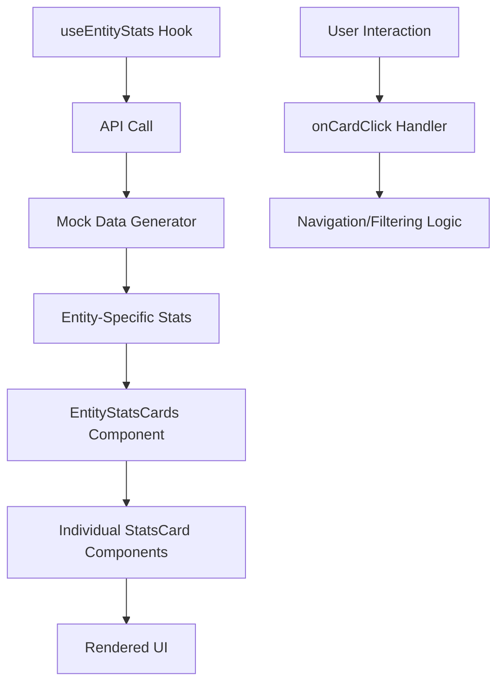

# Universal Stats Card System

A comprehensive, reusable stats card system for displaying analytics across different entity types (competencies, behavioral indicators, and assessment questions).

## 🎯 Features

- **🌍 Universal Design**: Single component system that works across all entity types
- **📱 Responsive**: Mobile-first design with adaptive layouts (2 cards on mobile, 4 on desktop)
- **🎨 Flexible Styling**: Multiple variants (default, success, warning, info, destructive)
- **📊 Smart Metrics**: Entity-specific stats with appropriate icons and descriptions
- **📈 Trend Indicators**: Optional trend badges with positive/negative indicators
- **⚡ Loading States**: Skeleton animations during data fetching
- **🎛️ Interactive**: Click handlers for navigation and filtering
- **♿ Accessible**: WCAG-compliant with proper ARIA labels and semantic HTML

## 📁 Component Structure

```
src/
├── components/
│   ├── ui/
│   │   └── stats-card.tsx         # Base reusable stats card component
│   └── EntityStatsCards.tsx       # Entity-specific stats card manager
├── hooks/
│   └── use-entity-stats.ts        # Data fetching hook for all entity types
└── app/
    ├── competencies/page.tsx      # Updated competencies page
    ├── behavioral-indicators/page.tsx  # Updated indicators page
    ├── assessment-questions/page.tsx   # Updated questions page
    └── stats-demo/page.tsx        # Comprehensive demo page
```

## 🚀 Quick Start

### 1. Basic Usage

```tsx
import EntityStatsCards from "@/components/EntityStatsCards";
import { useEntityStats } from "@/hooks/use-entity-stats";

function MyPage() {
  const { stats, loading, error, refresh } = useEntityStats("competencies");

  return (
    <EntityStatsCards
      type="competencies"
      data={stats || { total: 0 }}
      loading={loading}
      onCardClick={(cardType) => handleCardClick(cardType)}
      showTrends={true}
    />
  );
}
```

### 2. Individual Stats Card

```tsx
import { StatsCard } from "@/components/ui/stats-card";
import { BarChart3 } from "lucide-react";

function CustomCard() {
  return (
    <StatsCard
      title="Total Items"
      value={42}
      icon={BarChart3}
      description="Active items in system"
      variant="success"
      size="md"
      trend={{
        value: "+12%",
        label: "vs last month",
        isPositive: true
      }}
      onClick={() => console.log("Card clicked")}
    />
  );
}
```

## 📊 Entity Types & Metrics

### Competencies
- **Total Competencies**: Count of all competencies
- **Average Weight**: Mean competency weight percentage
- **With Assessments**: Competencies with active assessments
- **Advanced Level**: Advanced & expert level competencies

### Behavioral Indicators
- **Total Indicators**: Count of all behavioral indicators
- **With Questions**: Indicators with assessment questions
- **Average Complexity**: Mean indicator complexity score
- **Measurable**: Quantifiable indicators

### Assessment Questions
- **Total Questions**: Count of all assessment questions
- **With Indicators**: Questions linked to indicators
- **Average Score**: Mean question performance
- **Hard Questions**: High difficulty questions

## 🎨 Customization

### Variants
```tsx
<StatsCard variant="default" />   // Default gray theme
<StatsCard variant="success" />   // Green theme for positive metrics
<StatsCard variant="warning" />   // Yellow theme for attention items
<StatsCard variant="info" />      // Blue theme for informational data
<StatsCard variant="destructive" /> // Red theme for critical alerts
```

### Sizes
```tsx
<StatsCard size="sm" />  // Compact cards for dashboards
<StatsCard size="md" />  // Standard size (default)
<StatsCard size="lg" />  // Large cards for emphasis
```

### Responsive Behavior
```tsx
// Mobile-first responsive design
<EntityStatsCards 
  compact={true}        // Forces compact layout
  showTrends={false}    // Hides trends on mobile
/>
```

## 🔄 Data Flow



## 🎭 Demo

Visit `/stats-demo` to see the complete system in action with:
- All entity types side-by-side
- Interactive controls (toggle trends, compact mode)
- Live data simulation
- Error handling examples
- Responsive behavior demonstration

## 🛠️ Implementation Details

### Hook Usage
```tsx
const { stats, loading, error, refresh } = useEntityStats(type);
```

- **stats**: Entity-specific data object
- **loading**: Boolean loading state
- **error**: Error message if fetch fails
- **refresh**: Function to refetch data

### Card Click Handling
```tsx
const handleStatsCardClick = (cardType: string) => {
  switch(cardType) {
    case "total":
      // Navigate to overview
      break;
    case "with-assessments":
      // Filter to show only items with assessments
      break;
    // Add more cases as needed
  }
};
```

### Error Handling
```tsx
{error && (
  <Card className="border-red-200 bg-red-50">
    <CardContent>
      <p className="text-red-600">Error: {error}</p>
    </CardContent>
  </Card>
)}
```

## 📱 Mobile Optimization

- **Container Queries**: Responsive design using CSS container queries
- **Touch Targets**: Minimum 44px touch targets for accessibility
- **Smart Truncation**: Text truncation with line clamping
- **Adaptive Layout**: 2-column on mobile, 4-column on desktop
- **Reduced Complexity**: Shows only essential metrics on small screens

## ♿ Accessibility

- **ARIA Labels**: Proper semantic HTML and ARIA attributes
- **Screen Reader Support**: Descriptive text and value announcements
- **Keyboard Navigation**: Full keyboard accessibility
- **Color Contrast**: WCAG AA compliant contrast ratios
- **Focus Management**: Clear focus indicators

## 🔧 Configuration

### Environment Variables
```env
# API endpoints (if using real data)
NEXT_PUBLIC_API_BASE_URL=https://api.example.com
```

### TypeScript Interfaces
```tsx
interface StatsCardProps {
  title: string;
  value: number | string;
  icon?: LucideIcon;
  description?: string;
  trend?: TrendData;
  variant?: "default" | "success" | "warning" | "info" | "destructive";
  size?: "sm" | "md" | "lg";
  loading?: boolean;
  onClick?: () => void;
  className?: string;
  children?: React.ReactNode;
}
```

## 🔄 Migration Guide

### From Old Stats Components

**Before:**
```tsx
// app/competencies/page.tsx
import CompetencyStats from "./components/CompetencyStats";

<CompetencyStats competencies={competencies} />
```

**After:**
```tsx
// app/competencies/page.tsx
import EntityStatsCards from "@/components/EntityStatsCards";
import { useEntityStats } from "@/hooks/use-entity-stats";

const { stats, loading } = useEntityStats("competencies");

<EntityStatsCards
  type="competencies"
  data={stats || { total: 0 }}
  loading={loading}
  onCardClick={handleStatsCardClick}
  showTrends={true}
/>
```

## 🚦 Performance

- **Lazy Loading**: Components render only when needed
- **Memoization**: React.useMemo for expensive calculations
- **Efficient Re-renders**: Optimized state management
- **Code Splitting**: Automatic Next.js code splitting

## 🧪 Testing

```bash
# Build the application
npm run build

# Run in development
npm run dev

# Visit demo page
open http://localhost:3000/stats-demo
```

## 🤝 Contributing

1. **Add New Entity Type**:
   - Update `EntityType` type in `use-entity-stats.ts`
   - Add stats generator function
   - Create card configuration in `EntityStatsCards.tsx`

2. **Add New Metric**:
   - Extend entity stats interface
   - Update mock data generator
   - Add card configuration

3. **Custom Variants**:
   - Add to `variantStyles` in `stats-card.tsx`
   - Update TypeScript types
   - Add documentation

## 📄 License

This component system is part of the SkillSoft competency management platform.