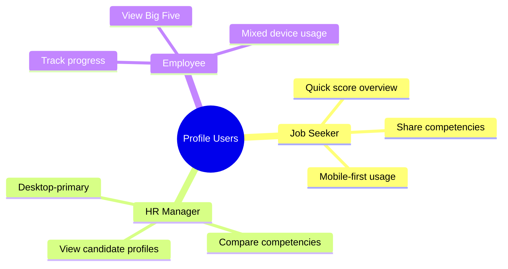
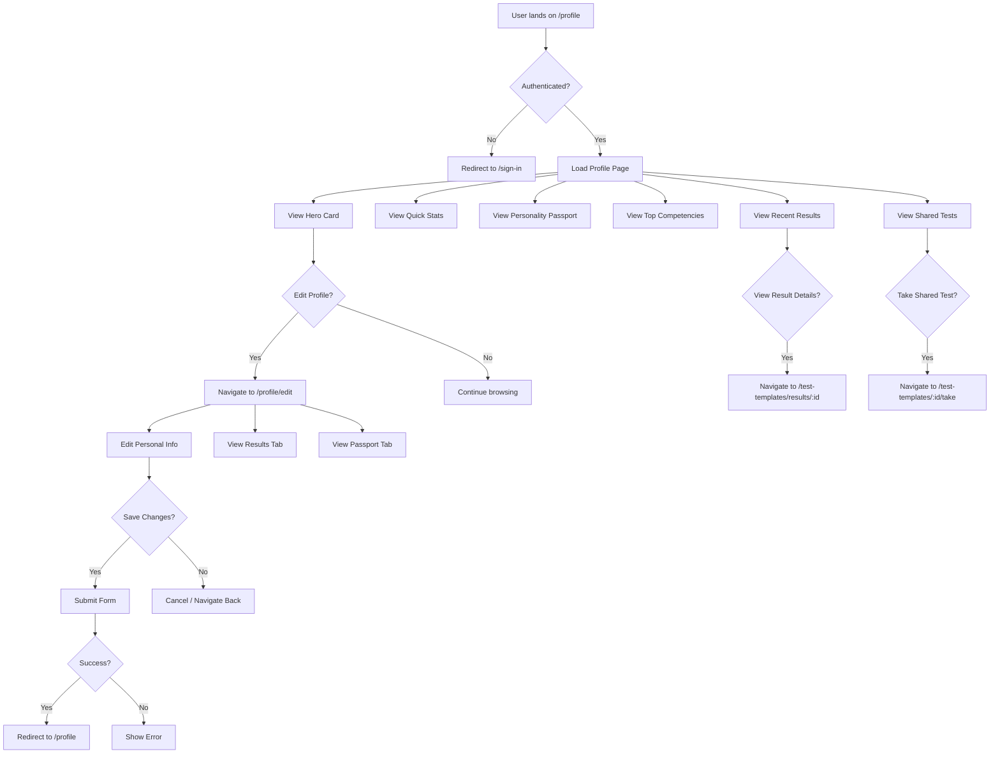
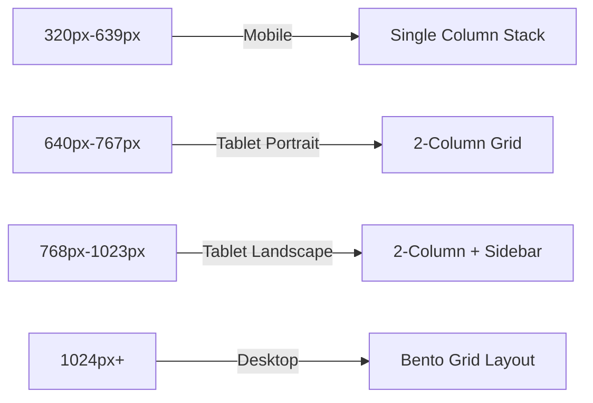
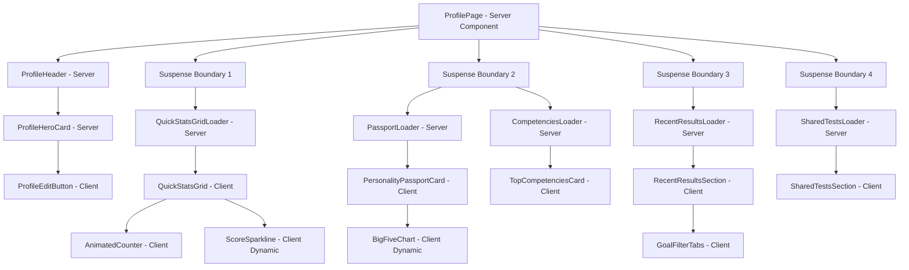
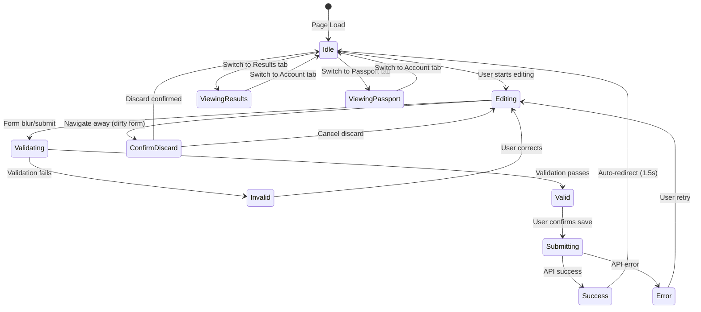
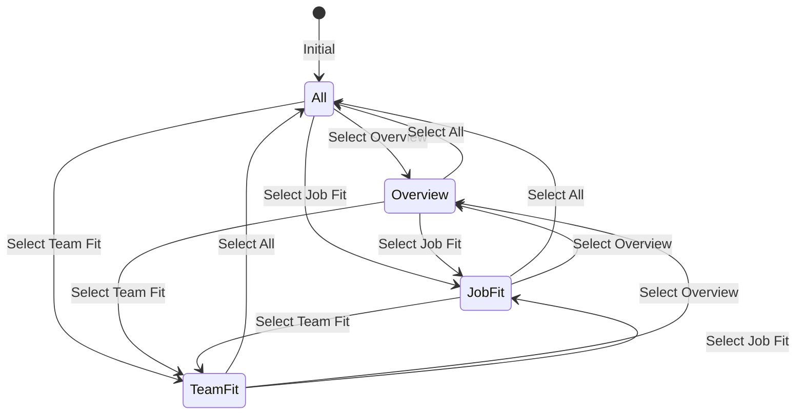
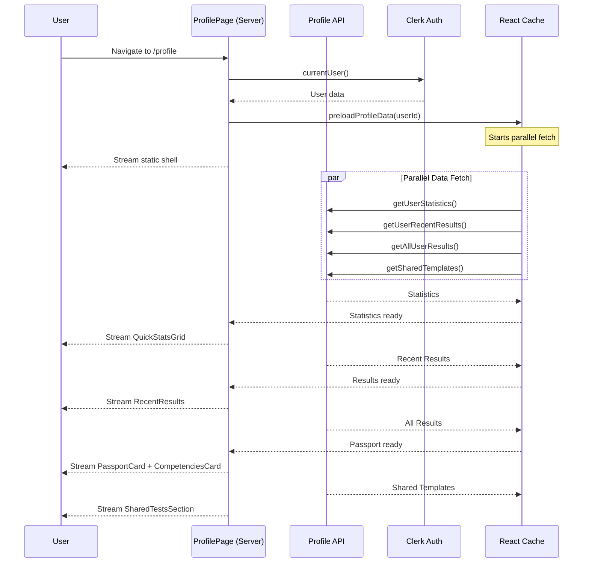
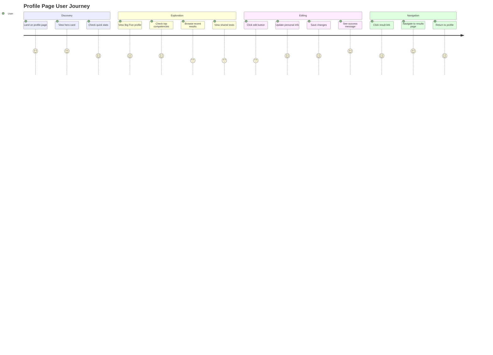
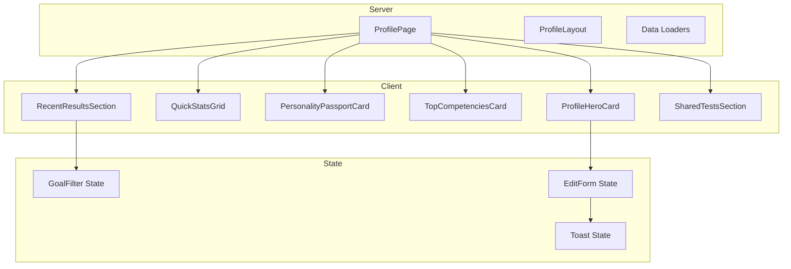

# Profile Page Redesign Workflow Architecture

## Document Version: 1.0
## Author: Principal Software Architect
## Date: 2026-01-09
## Target: Next.js 16 / React 19 / Tailwind v4

---

## Table of Contents

1. [Executive Summary](#executive-summary)
2. [Current State Analysis](#current-state-analysis)
3. [UX Research Considerations](#ux-research-considerations)
4. [Mobile-First Responsive Strategy](#mobile-first-responsive-strategy)
5. [i18n Architecture](#i18n-architecture)
6. [Component Architecture](#component-architecture)
7. [State Machine Design](#state-machine-design)
8. [Data Fetching Strategy](#data-fetching-strategy)
9. [Error Handling Patterns](#error-handling-patterns)
10. [Implementation Phases](#implementation-phases)
11. [Technical Specifications](#technical-specifications)
12. [Appendix: Mermaid Diagrams](#appendix-mermaid-diagrams)

---

## Executive Summary

### Objective
Redesign the profile page (`/profile`) with a mobile-first approach, full i18n support (English/Russian), and enhanced UX efficiency using modern Next.js 16 patterns.

### Key Deliverables
- Mobile-optimized bento grid layout
- Full bilingual support with `next-intl`
- Server Component optimization with streaming
- Improved accessibility (WCAG 2.1 AA compliance)
- State machines for complex interactions
- Performance optimizations (LCP < 2.5s, FID < 100ms)

### Scope
| In Scope | Out of Scope |
|----------|--------------|
| Profile page (`/profile`) | Settings page |
| Profile edit page (`/profile/edit`) | Authentication flows |
| i18n translation keys | Backend API changes |
| Responsive design (320px - 2560px) | Database schema changes |
| Skeleton loading states | Third-party integrations |
| Error boundaries | Avatar upload (Clerk-managed) |

---

## Current State Analysis

### Existing Component Structure

```
frontend-app/app/(workspace)/profile/
├── page.tsx                          # Server Component (main page)
├── loading.tsx                       # Page-level skeleton
├── error.tsx                         # Error boundary
├── _components/
│   ├── ProfileHeroCard.tsx           # User info card
│   ├── QuickStatsGrid.tsx            # Stats grid (Client Component)
│   ├── PersonalityPassportCard.tsx   # Big Five visualization
│   ├── TopCompetenciesCard.tsx       # Top competencies list
│   ├── RecentResultsSection.tsx      # Recent test results
│   ├── SharedTestsSection.tsx        # Shared tests (has i18n)
│   ├── GoalFilterTabs.tsx            # Filter tabs
│   ├── BigFiveChart.tsx              # Radar chart
│   ├── ScoreSparkline.tsx            # Mini chart
│   └── ProfileSkeleton.tsx           # Loading skeleton
└── edit/
    ├── page.tsx                      # Edit page
    ├── _actions/
    │   └── profile-actions.ts        # Server Actions
    └── _components/
        ├── ProfileEditContent.tsx    # Tab-based edit form
        ├── AccountInfoSection.tsx    # Personal info form
        ├── PreferencesSection.tsx    # User preferences
        └── ProfileEditSkeleton.tsx   # Edit skeleton
```

### Current Pain Points

1. **i18n Inconsistency**: Mixed Russian hardcoded strings and `useTranslations()` usage
   - `ProfileHeroCard.tsx`: Hardcoded Russian ("Пользователь", "Изменить", etc.)
   - `QuickStatsGrid.tsx`: Hardcoded Russian ("Пройдено тестов", etc.)
   - `SharedTestsSection.tsx`: Properly uses `useTranslations()`

2. **Mobile Layout Issues**:
   - `ProfileHeroCard`: Good responsive design with `sm:` breakpoints
   - `PersonalityPassportCard`: Radar chart sizing issues on small screens
   - `TopCompetenciesCard`: Touch targets could be improved

3. **Performance**:
   - Client Components for interactive elements (correct)
   - Preloading implemented via `preloadProfileData()`
   - ISR with 60-second revalidation

4. **Accessibility Gaps**:
   - Missing `aria-labels` on some interactive elements
   - Color contrast issues in some badge variants
   - Keyboard navigation incomplete

### What Works Well

- Server Component architecture with proper Suspense boundaries
- Parallel data fetching with `Promise.all()`
- Request deduplication via React `cache()`
- Staggered animations for visual polish
- Skeleton loading states for all sections

---

## UX Research Considerations

### User Personas



### User Flow Analysis



### Pain Points Identified

| Issue | Severity | Impact Area |
|-------|----------|-------------|
| Language switching requires page reload | High | UX |
| No empty state guidance for new users | Medium | Onboarding |
| Radar chart hard to read on mobile | High | Mobile UX |
| Edit form lacks autosave | Medium | Data Loss Prevention |
| No confirmation for navigation away from dirty form | Medium | Data Loss Prevention |
| Limited feedback on successful actions | Low | UX Polish |

### Proposed Solutions

1. **Language Switching**: Implement locale state with `next-intl` cookie persistence
2. **Empty States**: Add illustrated empty states with CTAs
3. **Mobile Radar Chart**: Replace with horizontal bar chart below 640px
4. **Form Autosave**: Debounced draft saving to localStorage
5. **Navigation Guard**: Use `beforeunload` event and custom confirmation dialog
6. **Action Feedback**: Toast notifications via `sonner`

---

## Mobile-First Responsive Strategy

### Breakpoint System

```css
/* Tailwind v4 Breakpoints (project-specific) */
--breakpoint-xs: 320px;   /* Small phones */
--breakpoint-sm: 640px;   /* Large phones / Small tablets */
--breakpoint-md: 768px;   /* Tablets */
--breakpoint-lg: 1024px;  /* Laptops */
--breakpoint-xl: 1280px;  /* Desktops */
--breakpoint-2xl: 1536px; /* Large monitors */
```

### Layout Strategy by Breakpoint



### Component-Specific Responsiveness

#### ProfileHeroCard
```
Mobile (< 640px):
┌────────────────────────────────┐
│ [Avatar] Name         [Edit] │
│          @organization       │
│          📅 Member since     │
└────────────────────────────────┘

Desktop (>= 640px):
┌────────────────────────────────────────────────┐
│ [Avatar]  Name                    [Edit] [⚙️] │
│           @organization • 📅 Since date       │
└────────────────────────────────────────────────┘
```

#### QuickStatsGrid
```
Mobile (< 640px): 2x2 grid
┌─────────┬─────────┐
│ Tests   │ Score   │
├─────────┼─────────┤
│ Pass %  │ Last    │
└─────────┴─────────┘

Desktop (>= 1024px): 4x1 grid
┌─────────┬─────────┬─────────┬─────────┐
│ Tests   │ Score   │ Pass %  │ Last    │
└─────────┴─────────┴─────────┴─────────┘
```

#### PersonalityPassportCard (Big Five)
```
Mobile (< 640px): Horizontal bars (no radar)
┌────────────────────────────────┐
│ Openness        ████████░░ 80 │
│ Conscientiousn. ██████░░░░ 60 │
│ Extraversion    ███████░░░ 70 │
│ Agreeableness   █████░░░░░ 50 │
│ Emotional Stab. ██████████ 95 │
└────────────────────────────────┘

Desktop (>= 640px): Radar chart + bars
┌────────────────────────────────────┐
│    [Radar Chart]    │   Bars List  │
└────────────────────────────────────┘
```

### Touch Target Guidelines

| Element | Minimum Size | Current | Action |
|---------|--------------|---------|--------|
| Buttons | 44x44px | 36-40px | Increase |
| Tab triggers | 44x44px | 40px | Increase |
| Links in lists | 44x44px | 36px | Increase |
| Icon buttons | 44x44px | 28-32px | Increase |

### Spacing Scale (Mobile-First)

```typescript
// Profile-specific spacing tokens
const profileSpacing = {
  'section-gap': {
    mobile: '0.75rem',  // 12px
    tablet: '1rem',     // 16px
    desktop: '1.5rem',  // 24px
  },
  'card-padding': {
    mobile: '0.75rem',  // 12px
    tablet: '1rem',     // 16px
    desktop: '1.5rem',  // 24px
  },
  'header-margin': {
    mobile: '1rem',     // 16px
    tablet: '1.5rem',   // 24px
    desktop: '2rem',    // 32px
  },
};
```

---

## i18n Architecture

### Current i18n Stack

- **Library**: `next-intl` (already integrated)
- **Locales**: `en`, `ru` (Russian default)
- **Message Files**: `messages/en.json`, `messages/ru.json`

### Profile Namespace Structure

```json
{
  "profile": {
    "page": {
      "title": "My Profile",
      "description": "View your assessment results and competency passport"
    },
    "hero": {
      "online": "Online",
      "editProfile": "Edit",
      "settings": "Settings",
      "memberSince": "{time} ago"
    },
    "stats": {
      "testsCompleted": "Tests completed",
      "averageScore": "Average score",
      "passRate": "Pass rate",
      "lastTest": "Last test",
      "profileProgress": "Profile",
      "trend": "Trend",
      "excellent": "Excellent",
      "good": "Good",
      "average": "Average",
      "low": "Low",
      "highRate": "High",
      "goodRate": "Good",
      "averageRate": "Average",
      "lowRate": "Low",
      "vsLastMonth": "vs last month",
      "vsPreviousTests": "vs previous tests"
    },
    "passport": {
      "title": "Big Five Profile",
      "basedOn": "Based on {count} assessments",
      "dominantTrait": "Dominant trait",
      "confidence": {
        "low": "Low",
        "medium": "Medium",
        "high": "High"
      },
      "confidenceTooltip": {
        "low": "Complete more tests to improve accuracy",
        "medium": "Sufficient data for basic profile",
        "high": "Reliable profile based on multiple assessments"
      },
      "traits": {
        "OPENNESS": "Openness",
        "CONSCIENTIOUSNESS": "Conscientiousness",
        "EXTRAVERSION": "Extraversion",
        "AGREEABLENESS": "Agreeableness",
        "EMOTIONAL_STABILITY": "Emotional Stability"
      }
    },
    "competencies": {
      "title": "Top Competencies",
      "basedOn": "Based on {count} assessments",
      "viewAll": "View all",
      "assessments": "{count} assessments",
      "trend": {
        "up": "Improving",
        "down": "Declining",
        "stable": "Stable"
      },
      "empty": {
        "title": "No data yet",
        "description": "Complete some tests to see your strongest competencies",
        "action": "Start testing"
      }
    },
    "results": {
      "title": "Recent Results",
      "viewAll": "All results",
      "filterAll": "All",
      "noResults": "No results yet",
      "noResultsDesc": "Complete your first test to see results here",
      "noFilterResults": "No results for selected filter",
      "startTesting": "Start testing"
    },
    "edit": {
      "pageTitle": "Edit Profile",
      "pageDescription": "Update your personal information and settings",
      "tabs": {
        "account": "Account",
        "results": "Results",
        "passport": "Passport"
      },
      "account": {
        "title": "Personal Information",
        "description": "Update your personal details",
        "avatarManaged": "Avatar is managed via Clerk.",
        "changeInSettings": "Change it in account settings.",
        "firstName": "First Name",
        "lastName": "Last Name",
        "email": "Email",
        "emailReadOnly": "Email cannot be changed here. Update via Clerk settings.",
        "organization": "Organization",
        "organizationPlaceholder": "Organization name (optional)"
      },
      "actions": {
        "save": "Save",
        "saving": "Saving...",
        "cancel": "Cancel"
      },
      "validation": {
        "firstNameRequired": "First name is required",
        "firstNameMax": "First name must not exceed 50 characters",
        "lastNameRequired": "Last name is required",
        "lastNameMax": "Last name must not exceed 50 characters",
        "organizationMax": "Organization name must not exceed 100 characters"
      },
      "messages": {
        "saveSuccess": "Profile updated successfully",
        "saveError": "Failed to update profile"
      }
    }
  }
}
```

### Translation Migration Strategy

#### Phase 1: Extract hardcoded strings
1. Audit all profile components for hardcoded text
2. Create comprehensive translation keys
3. Add keys to both `en.json` and `ru.json`

#### Phase 2: Convert Server Components
```typescript
// Before (hardcoded)
<h1>Мой профиль</h1>

// After (with next-intl server)
import { getTranslations } from 'next-intl/server';

export default async function ProfilePage() {
  const t = await getTranslations('profile.page');
  return <h1>{t('title')}</h1>;
}
```

#### Phase 3: Convert Client Components
```typescript
// Client Component pattern
'use client';
import { useTranslations } from 'next-intl';

export function QuickStatsGrid({ summary }) {
  const t = useTranslations('profile.stats');
  return <span>{t('testsCompleted')}</span>;
}
```

#### Phase 4: Date/Time Localization
```typescript
import { useFormatter } from 'next-intl';

function RelativeTime({ date }) {
  const format = useFormatter();
  return <span>{format.relativeTime(date)}</span>;
}
```

### i18n Testing Strategy

1. **Visual regression tests** for both locales
2. **Translation coverage tests** (already exists at `src/__tests__/i18n/`)
3. **RTL considerations** (not needed for en/ru but architecture should support)
4. **Placeholder interpolation tests**

---

## Component Architecture

### Recommended Component Hierarchy



### New Component Proposals

#### 1. ProfileBreadcrumbs (Server Component)
```typescript
// Already handled by app sidebar breadcrumbs
```

#### 2. ProfileEmptyState (Server Component)
```typescript
interface ProfileEmptyStateProps {
  variant: 'new-user' | 'no-results' | 'no-competencies';
  locale: Locale;
}
```

#### 3. MobileBigFiveBars (Client Component)
```typescript
// Replaces radar chart on mobile
interface MobileBigFiveBarsProps {
  profile: BigFiveProfile;
  compact?: boolean;
}
```

#### 4. ProfileLanguageSwitcher (Client Component)
```typescript
// Quick language toggle for profile context
interface ProfileLanguageSwitcherProps {
  currentLocale: Locale;
}
```

### shadcn/ui Components to Leverage

| Component | Usage | Status |
|-----------|-------|--------|
| Card | All profile sections | In use |
| Tabs | Edit page navigation | In use |
| Avatar | User avatar | In use |
| Badge | Status indicators | In use |
| Button | Actions | In use |
| Progress | Score bars | Consider |
| Skeleton | Loading states | In use |
| Tooltip | Info tooltips | In use |
| Alert | Messages | In use |
| Form | Edit forms | In use |
| Input | Form fields | In use |
| Label | Form labels | In use |
| Select | Preferences | Consider |
| Switch | Toggle settings | In use |
| Sheet | Mobile menus | Consider |
| Drawer | Mobile edit | Consider |
| ScrollArea | Scrollable lists | In use |
| Separator | Visual dividers | Consider |

---

## State Machine Design

### Profile Edit State Machine



### State Machine Implementation (XState v5)

```typescript
import { createMachine, assign } from 'xstate';

interface ProfileEditContext {
  formData: ProfileEditFormData;
  errors: Record<string, string>;
  isDirty: boolean;
  message: { type: 'success' | 'error'; text: string } | null;
}

type ProfileEditEvent =
  | { type: 'EDIT'; field: string; value: string }
  | { type: 'SUBMIT' }
  | { type: 'VALIDATION_SUCCESS' }
  | { type: 'VALIDATION_ERROR'; errors: Record<string, string> }
  | { type: 'SAVE_SUCCESS'; message: string }
  | { type: 'SAVE_ERROR'; message: string }
  | { type: 'NAVIGATE_AWAY' }
  | { type: 'CONFIRM_DISCARD' }
  | { type: 'CANCEL_DISCARD' }
  | { type: 'SWITCH_TAB'; tab: 'account' | 'results' | 'passport' };

const profileEditMachine = createMachine({
  id: 'profileEdit',
  initial: 'idle',
  context: {
    formData: {},
    errors: {},
    isDirty: false,
    message: null,
  },
  states: {
    idle: {
      on: {
        EDIT: {
          target: 'editing',
          actions: 'updateField',
        },
        SWITCH_TAB: 'viewingTab',
      },
    },
    editing: {
      on: {
        EDIT: {
          actions: 'updateField',
        },
        SUBMIT: 'validating',
        NAVIGATE_AWAY: [
          {
            target: 'confirmDiscard',
            guard: 'isDirty',
          },
          {
            target: 'idle',
          },
        ],
      },
    },
    validating: {
      invoke: {
        src: 'validateForm',
        onDone: {
          target: 'submitting',
        },
        onError: {
          target: 'invalid',
          actions: 'setErrors',
        },
      },
    },
    invalid: {
      on: {
        EDIT: {
          target: 'editing',
          actions: ['updateField', 'clearFieldError'],
        },
      },
    },
    submitting: {
      invoke: {
        src: 'saveProfile',
        onDone: {
          target: 'success',
          actions: 'setSuccessMessage',
        },
        onError: {
          target: 'error',
          actions: 'setErrorMessage',
        },
      },
    },
    success: {
      after: {
        1500: 'idle',
      },
    },
    error: {
      on: {
        EDIT: {
          target: 'editing',
          actions: 'updateField',
        },
      },
    },
    confirmDiscard: {
      on: {
        CONFIRM_DISCARD: 'idle',
        CANCEL_DISCARD: 'editing',
      },
    },
    viewingTab: {
      on: {
        SWITCH_TAB: [
          {
            target: 'editing',
            guard: ({ event }) => event.tab === 'account',
          },
        ],
      },
    },
  },
});
```

### Goal Filter State Machine



---

## Data Fetching Strategy

### Current Architecture (Good)

```typescript
// Server Component with preloading
export default async function ProfilePage() {
  const user = await currentUser();

  // Preload data immediately
  preloadProfileData(user.id);

  return (
    <Suspense fallback={<QuickStatsGridSkeleton />}>
      <QuickStatsGridLoader userId={user.id} />
    </Suspense>
  );
}

// Unified data fetcher with React cache()
export const getUnifiedProfileData = cache(async (clerkUserId: string) => {
  const [statistics, recentData, allResults] = await Promise.all([
    getUserStatistics(clerkUserId),
    getUserRecentResults(clerkUserId, 0, 5),
    getAllUserResults(clerkUserId),
  ]);
  return { statistics, recentResults, allResults };
});
```

### Recommended Optimizations

#### 1. Streaming with Granular Suspense
```typescript
// Current: Good
<Suspense fallback={<QuickStatsGridSkeleton />}>
  <QuickStatsGridLoader userId={user.id} />
</Suspense>

// Enhanced: Add loading priority hints
<Suspense fallback={<ProfileHeroSkeleton />}>
  {/* Critical path - load first */}
  <ProfileHeroCard userInfo={userInfo} />
</Suspense>

<Suspense fallback={<QuickStatsGridSkeleton />}>
  {/* High priority */}
  <QuickStatsGridLoader userId={user.id} />
</Suspense>

<Suspense fallback={<PassportSkeleton />}>
  {/* Medium priority - can stream later */}
  <PassportLoader userId={user.id} />
</Suspense>
```

#### 2. Partial Pre-rendering (PPR) Preparation
```typescript
// next.config.ts
export default {
  experimental: {
    ppr: true,
  },
};

// Static shell + dynamic data
export default async function ProfilePage() {
  return (
    <div className="min-h-screen bg-muted/30">
      {/* Static shell - rendered at build time */}
      <header className="mb-4 sm:mb-6 px-1">
        {/* ... static header content ... */}
      </header>

      {/* Dynamic content - streamed */}
      <Suspense fallback={<ProfileSkeleton />}>
        <ProfileContent />
      </Suspense>
    </div>
  );
}
```

#### 3. Optimistic Updates for Edit Form
```typescript
// Server Action with revalidation
'use server';

export async function updateProfileAction(
  clerkId: string,
  data: ProfileEditFormData
) {
  // Optimistic update pattern
  try {
    const result = await updateProfile(clerkId, data);
    revalidatePath('/profile');
    revalidatePath('/profile/edit');
    return { success: true, message: 'Profile updated' };
  } catch (error) {
    return { success: false, message: 'Update failed' };
  }
}
```

### Data Flow Diagram



---

## Error Handling Patterns

### Error Boundary Structure

```typescript
// app/(workspace)/profile/error.tsx
'use client';

import { useEffect } from 'react';
import { useTranslations } from 'next-intl';
import { Button } from '@/components/ui/button';
import { AlertCircle, RefreshCw } from 'lucide-react';

export default function ProfileError({
  error,
  reset,
}: {
  error: Error & { digest?: string };
  reset: () => void;
}) {
  const t = useTranslations('errors');

  useEffect(() => {
    console.error('[Profile Error]', error);
  }, [error]);

  return (
    <div className="flex flex-col items-center justify-center min-h-[50vh] p-4">
      <AlertCircle className="h-12 w-12 text-destructive mb-4" />
      <h2 className="text-lg font-semibold mb-2">{t('somethingWentWrong')}</h2>
      <p className="text-muted-foreground text-center mb-4">
        {t('errorLoadingPage')}
      </p>
      <Button onClick={reset} variant="outline">
        <RefreshCw className="h-4 w-4 mr-2" />
        {t('tryAgain')}
      </Button>
    </div>
  );
}
```

### Component-Level Error Handling

```typescript
// Pattern for section-level errors
function ProfileSectionError({
  section,
  onRetry
}: {
  section: string;
  onRetry?: () => void;
}) {
  const t = useTranslations('profile.errors');

  return (
    <Card className="border-destructive/50">
      <CardContent className="p-4 text-center">
        <AlertCircle className="h-8 w-8 text-destructive mx-auto mb-2" />
        <p className="text-sm text-muted-foreground">
          {t('sectionError', { section })}
        </p>
        {onRetry && (
          <Button
            variant="ghost"
            size="sm"
            onClick={onRetry}
            className="mt-2"
          >
            {t('retry')}
          </Button>
        )}
      </CardContent>
    </Card>
  );
}
```

### API Error Mapping

```typescript
// services/profile-api.ts error handling
export async function handleProfileApiError(error: unknown): Promise<never> {
  if (error instanceof Response) {
    const status = error.status;

    if (status === 401) {
      redirect('/sign-in');
    }

    if (status === 403) {
      throw new Error('ACCESS_DENIED');
    }

    if (status === 404) {
      throw new Error('PROFILE_NOT_FOUND');
    }

    if (status >= 500) {
      throw new Error('SERVER_ERROR');
    }
  }

  throw new Error('UNKNOWN_ERROR');
}
```

### Error State Types

```typescript
// types/profile.ts - already exists, extend if needed
export interface ProfileError {
  code: 'NETWORK' | 'AUTH' | 'SERVER' | 'VALIDATION' | 'UNKNOWN';
  message: string;
  retryable: boolean;
  timestamp: Date;
}
```

---

## Implementation Phases

### Phase 1: i18n Migration (Week 1-2)

**Objective**: Full translation coverage for profile pages

**Tasks**:
1. [ ] Create comprehensive translation keys in `messages/en.json`
2. [ ] Create Russian translations in `messages/ru.json`
3. [ ] Convert `ProfileHeroCard` to use `useTranslations()`
4. [ ] Convert `QuickStatsGrid` to use `useTranslations()`
5. [ ] Convert `PersonalityPassportCard` to use `useTranslations()`
6. [ ] Convert `TopCompetenciesCard` to use `useTranslations()`
7. [ ] Convert `RecentResultsSection` to use `useTranslations()`
8. [ ] Update date formatting to use `useFormatter()`
9. [ ] Add i18n tests for profile namespace
10. [ ] Update metadata with translations

**Deliverables**:
- All profile strings externalized
- Both locales tested
- Translation coverage at 100%

### Phase 2: Mobile Optimization (Week 3-4)

**Objective**: Pixel-perfect mobile experience

**Tasks**:
1. [ ] Audit all components with Chrome DevTools device emulation
2. [ ] Create `MobileBigFiveBars` component for < 640px
3. [ ] Increase all touch targets to minimum 44x44px
4. [ ] Optimize card padding for mobile (reduce to 12px)
5. [ ] Implement horizontal scroll for filter tabs on mobile
6. [ ] Add swipe gestures for tab navigation (optional)
7. [ ] Test on real devices (iOS Safari, Android Chrome)
8. [ ] Fix any overflow issues on 320px width
9. [ ] Optimize images with responsive srcset
10. [ ] Add viewport meta tag optimizations

**Deliverables**:
- Responsive design tested on 5+ device sizes
- Lighthouse mobile score > 90
- No horizontal scroll issues
- Touch-friendly interactions

### Phase 3: UX Enhancements (Week 5-6)

**Objective**: Improved user experience and polish

**Tasks**:
1. [ ] Add toast notifications for save/error feedback
2. [ ] Implement form autosave to localStorage
3. [ ] Add navigation guard for dirty form
4. [ ] Create illustrated empty states
5. [ ] Add success animations (Framer Motion)
6. [ ] Implement pull-to-refresh (mobile)
7. [ ] Add keyboard shortcuts (desktop)
8. [ ] Improve loading skeleton fidelity
9. [ ] Add micro-interactions (hover, focus states)
10. [ ] Implement language switcher component

**Deliverables**:
- Polished UI interactions
- No data loss scenarios
- Improved perceived performance
- Better user feedback

### Phase 4: Performance & Accessibility (Week 7-8)

**Objective**: Production-ready performance and accessibility

**Tasks**:
1. [ ] Run Lighthouse audit and fix issues
2. [ ] Implement dynamic imports for charts
3. [ ] Add `loading="lazy"` to non-critical images
4. [ ] Audit and fix WCAG 2.1 AA issues
5. [ ] Add screen reader announcements
6. [ ] Test with keyboard-only navigation
7. [ ] Add focus trapping in modals
8. [ ] Optimize bundle size (tree shaking)
9. [ ] Add performance monitoring (Web Vitals)
10. [ ] Document accessibility patterns

**Deliverables**:
- LCP < 2.5s
- FID < 100ms
- CLS < 0.1
- WCAG 2.1 AA compliance
- Axe accessibility audit pass

---

## Technical Specifications

### File Structure (Proposed)

```
frontend-app/app/(workspace)/profile/
├── page.tsx                          # Main profile page
├── layout.tsx                        # Profile layout (optional)
├── loading.tsx                       # Page skeleton
├── error.tsx                         # Error boundary
├── not-found.tsx                     # 404 handler
├── _components/
│   ├── ProfileHeader.tsx             # Page header (Server)
│   ├── ProfileHeroCard.tsx           # User card (Server → Client)
│   ├── QuickStatsGrid/
│   │   ├── index.tsx                 # Exports
│   │   ├── QuickStatsGrid.tsx        # Main component (Client)
│   │   ├── StatCard.tsx              # Individual stat
│   │   └── QuickStatsGridSkeleton.tsx
│   ├── PersonalityPassport/
│   │   ├── index.tsx
│   │   ├── PersonalityPassportCard.tsx
│   │   ├── BigFiveRadarChart.tsx     # Desktop chart
│   │   ├── MobileBigFiveBars.tsx     # Mobile bars
│   │   └── PersonalityPassportSkeleton.tsx
│   ├── TopCompetencies/
│   │   ├── index.tsx
│   │   ├── TopCompetenciesCard.tsx
│   │   ├── CompetencyRow.tsx
│   │   └── TopCompetenciesSkeleton.tsx
│   ├── RecentResults/
│   │   ├── index.tsx
│   │   ├── RecentResultsSection.tsx
│   │   ├── ResultRow.tsx
│   │   ├── GoalFilterTabs.tsx
│   │   └── RecentResultsSkeleton.tsx
│   ├── SharedTests/
│   │   ├── index.tsx
│   │   ├── SharedTestsSection.tsx
│   │   ├── SharedTemplateCard.tsx
│   │   └── SharedTestsSkeleton.tsx
│   └── ui/
│       ├── ProfileEmptyState.tsx
│       ├── ScoreSparkline.tsx
│       └── AnimatedProgress.tsx
└── edit/
    ├── page.tsx
    ├── loading.tsx
    ├── error.tsx
    ├── _actions/
    │   └── profile-actions.ts
    ├── _components/
    │   ├── ProfileEditContent.tsx
    │   ├── AccountInfoSection.tsx
    │   ├── PreferencesSection.tsx
    │   └── ProfileEditSkeleton.tsx
    └── _hooks/
        └── useProfileEditMachine.ts   # XState hook
```

### Performance Budgets

| Metric | Budget | Current | Target |
|--------|--------|---------|--------|
| First Contentful Paint | 1.8s | ~1.5s | < 1.2s |
| Largest Contentful Paint | 2.5s | ~2.2s | < 2.0s |
| Time to Interactive | 3.8s | ~3.5s | < 3.0s |
| Cumulative Layout Shift | 0.1 | ~0.05 | < 0.05 |
| Total Blocking Time | 200ms | ~180ms | < 150ms |
| JS Bundle (page) | 150KB | ~120KB | < 100KB |

### Browser Support Matrix

| Browser | Version | Support Level |
|---------|---------|---------------|
| Chrome | 90+ | Full |
| Firefox | 90+ | Full |
| Safari | 14+ | Full |
| Edge | 90+ | Full |
| iOS Safari | 14+ | Full |
| Android Chrome | 90+ | Full |
| Samsung Internet | 14+ | Full |

---

## Appendix: Mermaid Diagrams

### Complete User Journey



### Component Communication



### Responsive Layout Diagram

```mermaid
graph TD
    subgraph Mobile["Mobile (< 640px)"]
        M1[Hero Card]
        M2[Stats 2x2]
        M3[Passport - Bars]
        M4[Competencies]
        M5[Results]
        M6[Shared Tests]
        M1 --> M2 --> M3 --> M4 --> M5 --> M6
    end

    subgraph Tablet["Tablet (640px - 1023px)"]
        T1[Hero Card]
        T2[Stats 2x2]
        T3[Passport | Competencies]
        T4[Results]
        T5[Shared Tests 2-col]
        T1 --> T2 --> T3 --> T4 --> T5
    end

    subgraph Desktop["Desktop (>= 1024px)"]
        D1[Hero Card]
        D2[Stats 4x1]
        D3[Passport | Competencies]
        D4[Results]
        D5[Shared Tests 3-col]
        D1 --> D2 --> D3 --> D4 --> D5
    end
```

---

## Approval Checklist

Before implementation begins, ensure:

- [ ] UX/UI Designer review of mobile layouts
- [ ] Translation team notified for Russian translations
- [ ] Backend team confirms no API changes needed
- [ ] QA team included in sprint planning
- [ ] Accessibility audit scheduled
- [ ] Performance baseline established
- [ ] Feature flags configured (if applicable)

---

## Document History

| Version | Date | Author | Changes |
|---------|------|--------|---------|
| 1.0 | 2026-01-09 | Principal Architect | Initial draft |

---

<drift_alert>
[Info] Current profile components have mixed i18n patterns - SharedTestsSection uses useTranslations() while others have hardcoded Russian strings.
[Info] Date formatting uses date-fns with hardcoded Russian locale (ru) - needs migration to next-intl useFormatter().
[Info] Some Client Components could potentially be Server Components with proper refactoring (ProfileHeroCard displays static user data).
</drift_alert>
